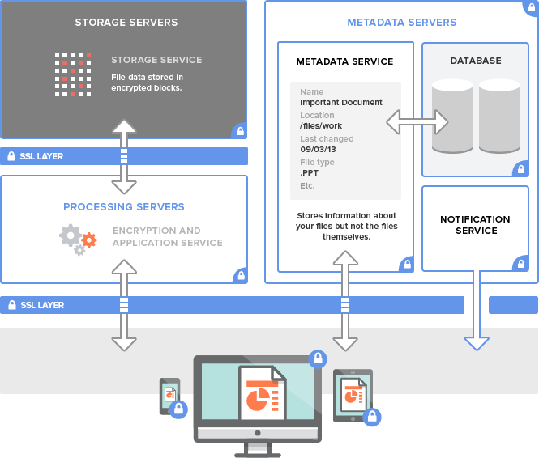

# Stand der Technik

In diesem Kapitel werden moderne Anwendungen anhand ihrer Architektur durchläuchtet, um die jeweilige Vorteile für Symcloud zusammenzufassen.

## \label{verteilte_systeme}Verteilte Systeme

Eine Definition von verteilten Systemen gibt Andrew Tanenbaum in seinem Buch Verteilte Systeme:

	"Ein verteiltes System ist eine Menge voneinander unabhängiger
	Computer, die dem Benutzer wie ein einzelnes kohärentes
	System erscheinen"

Diese Definition beinhaltet zwei Aspekte. Der eine Aspekt besagt, dass die einzelnen Maschinen in einem Verteilten System autonom sind. Der zweite bezieht sich auf die Software, die die Systeme miteinander verbinden. Durch die Software glaubt der Benutzer, dass er es mit einem einzigen System zu tun hat [siehe @tanenbaum2003verteilte, p. 18].

Ein nicht mehr ganz neues aber immer noch sehr aktuelles Verteiltes System ist das Netzwerk-Protokoll NFS (Network File Service). 

* __TODO beschreibung eines netzwerk protokolles__
* __TODO trennung metadaten und inhalt__

## Dropbox

Dropbox-Nutzer können jederzeit von ihrem Desktop aus über das Internet, über mobile Geräte oder über mit Dropbox verbundene Anwendungen auf Dateien und Ordner zugreifen. Alle diese Clients stellen Verbindungen mit sicheren Servern her, über die Sie Zugriff auf Dateien haben, Dateien für andere Nutzer freigeben können, und verknüpfte Geräte aktualisieren können, wenn Dateien hinzugefügt, verändert oder gelöscht werden. Der Dropbox-Service betreibt verschiedene Dienste, die sowohl für die Handhabung und Verarbeitung von Metadaten als auch von unformatiertem Blockspeicher verantwortlich sind. [siehe @dropbox2015a]

In der Abbildung \ref{db_archtecture} werden die einzelnen Komponenten in einem Blockdiagram dargestellt. Es gliedert sich in drei größere Blöcke:

* Metadata Servers
* Storage Servers
* Processing Servers
 
Wie im Kapitel \ref{verteilte_systeme} beschrieben trennt Dropbox intern die Dateien von ihren Metadaten. Der Metadata Service speichert die Metadaten und informationen zu ihrem Speicherort in einer Datenbank aber der Inhalt der Daten liegt in einem seperaten Storage Service. Dieser Service verteilt die Daten wie ein "Load Balancer" über viele Server.

Der Storage Service ist wiederum von aussen durch einen Application Service abgesichert. Die Authentifizierung erfolgt über das OAuth2 Protokoll [siehe @dropbox2015b]. Diese Authentifizierung wird für alle Services verwendet, also auch für den Metadata Service und der Notification Service.

## ownCloud

Nach den neuesten Entwicklungen arbeitet ownCloud an einem ähnlichen Feature wie Symcloud. Unter dem Namen "Remote shares" wurde in der Version 7 eine Erweiterung in den Core übernohmen, mit dem es möglich ist sogenannte "Shares" mittels einem Link auch in einer anderen Installation einzubinden. Dies ermöglicht es Dateien auch über die Grenzen des Servers hinweg zu teilen. [siehe @bizblokes2015a]

Die kostenpflichtige Variante von ownCloud geht hier noch einen Schritt weiter. In Abbildung \ref{owncloud_architecture} ist zu sehen, wie ownCloud als eine Art Verbindungsschicht zwischen verschiedenen "On-Site", also Daten die vor Ort bereitstehen, und Daten aus der Cloud dienen soll.  [siehe @owncloudarchitecture2015, p. 1]

![ownCloud Enterprise Architektur Übersicht [Quelle @owncloudarchitecture2015]\label{owncloud_architecture}](images/owncloud_architecture.png)

Um die Integration in ein Unternehmen zu erleichtern bietet es verschiedenste Services an. Unter anderem ist es möglich Benutzerdaten über LDAP oder ActiveDirectory zu verwalten und damit ein doppeltes Verwalten der Benutzer zu vermeiden. [siehe @owncloudarchitecture2015, p. 2]

![Bereitstellungs Szenario von ownCloud[Quelle @owncloudarchitecture2015]\label{owncloud_deployment}](images/owncloud_deployment.png)

Für einen produktiven Einsatz wird eine scalierbare Architektur, wie in Abbildung \ref{owncloud_deployment}, vorgeschlagen. An erster Stelle, steht ein Load-Balancer, die die Last der Anfragen an mindestens zwei Websterver verteilt. Diese Webserver sind mit einem MySQL-Cluster verbunden, in dem die User-Daten, Anwendungsdaten und Metadaten der Dateien gespeichert sind. Dieser Cluster besteht wiederum aus mindestens 2 Datenbank Servern. Dies ermöglicht auch bei stark frequentierten Installationen eine Horizontale Skalierbarkeit. Dadurch ist der Leistung des gesamten Systems kaum grenzen gesetzt. Zusaätzlich sind die Webserver mit dem File-Storage verbunden. Dieser kann wiederum skaliert werden. Dies wird jedoch als optional bezeichnet. [siehe @owncloudarchitecture2015, p. 3-4]

## Diaspora

__TODO kaum infos weitere suchen notwendig__

## Zusammenfassung

__TODO zusammenfassung state of the art chapter__
