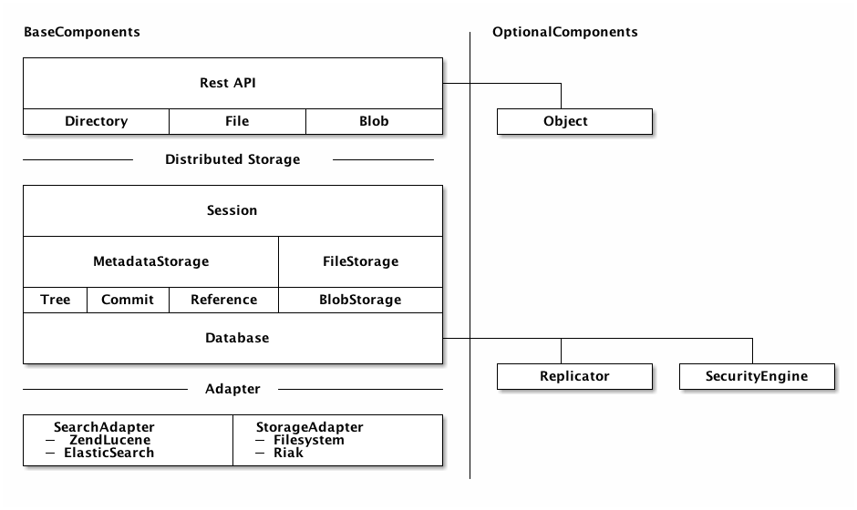
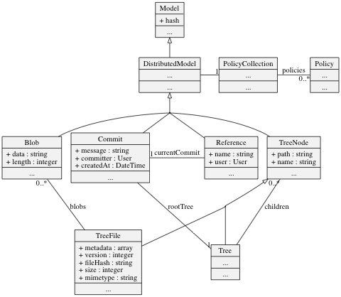

# Konzept für Symcloud\label{chapter_concept}

Dieses Kapitel befasst sich mit der Erstellung eines Speicher- und Architekturkonzeptes für Symcloud. Das zentrale Element dieses Konzeptes ist die Objekt-Datenbank. Diese Datenbank unterstützt die Verbindung zu anderen Servern. Damit ist Symcloud, als ganzes gesehen ein verteiltes Dateiverwaltungssystem. Es unterstützt dabei die Replikation von Nutz- und Metadaten unter den verbundenen Servern. Die Datenbank beinhaltet eine Suchmaschine, mit der es möglich ist, die Metadaten effizient zu durchsuchen. Die Grundlagen zu dieser Architektur wurden im Kapitel \ref{chapter_xtreemfs} beschrieben. Es ist eine Abwandlung der Architektur, die in XtreemFS verwendet wird.

## Überblick



Die Architektur ist gegliedert in Kern-Komponenten und optionale Komponenten. In der Abbildung \ref{architecture} sind die Abhängigkeiten der Komponenten untereinander zu erkennen. Die Schichten sind jeweils über ein Interface entkoppelt, um den Austausch einzelner Komponenten zu vereinfachen. Über den `StorageAdaper` bzw. über den `SearchAdapter`, lassen sich die Speicher der Daten anpassen. Für eine einfache Installation reicht es die Daten direkt auf die Festplatte zu schreiben. Es ist allerdings auch denkbar die Daten in eine Datenbank wie Riak oder MongoDB zu schreiben, um die Sicherheit zu erhöhen.

Durch die Implementierung (siehe Kapitel \ref{implementation}) als PHP-Bibliothek, ist es möglich diese Funktionalitäten in jeden beliebige Applikation zu integrieren. Durch Abstraktionen der Benutzerverwaltung ist Symcloud komplett entkoppelt vom eigentlichen System.

## Datenmodell

Das Datenmodell wurde speziell für Symcloud entwickelt, um seine Anforderungen zu erfüllen. Es sollte alle Anforderungen an das Projekt erfüllen, um eine optimale und effiziente Datenhaltung zu gewährleisten. Abgeleitet wurde das Model (siehe Abbildung \ref{data_model}) aus dem Model, dass dem Versionskontrollsystem GIT zugrunde liegt. Dieses Model unterstützt viele Anforderungen, welche Symcloud an seine Daten stellt.



### Exkurs: GIT

GIT[^41] ist ein verteilte Versionsverwaltung, das ursprünglich entwickelt wurde, um den Source-Code des Linux Kernels zu verwalten.


Die Software ist im Grunde eine Key-Value Datenbank. Es werden Objekte in Form einer Datei abgespeichert, in dem jeweils der Inhalt des Objekts abgespeichert wird. Der Name der Datei enthält den Key des Objektes. Dieser Key wird berechnet indem ein sogenannter SHA berechnet wird. Der SHA ist ein mittels "Secure-Hash-Algorithm" berechneter Hashwert der Daten. Das Listing \ref{git:calc_hash} zeigt, wie ein SHA in einem Terminal berechnet werden kann.

```{caption="Berechnung des SHA eines Objektes\label{git:calc_hash}" .bash}
$ OBJECT='blob 46\0{"name": "Johannes Wachter", "job": "Web-Developer"}'
$ echo -e $OBJECT | shasum
6c01d1dec5cf5221e86600baf77f011ed469b8fe -
```

Im Listing \ref{git:create_object_blob} wird ein GIT-Objekt vom Typ BLOB erstellt und in den `objects` Ordner geschrieben. 

```{caption="Erzeugung eines GIT-BLOB\label{git:create_object_blob}" .bash}
$ OBJECT='blob 46\0{"name": "Johannes Wachter", "job": "Web-Developer"}'
$ echo -e $OBJECT | git hash-object -w --stdin
6c01d1dec5cf5221e86600baf77f011ed469b8fe
$ find .git/objects -type f
    .git/objects/6c/01d1dec5cf5221e86600baf77f011ed469b8fe
```

Die Objekte in GIT sind immutable, also nicht veränderbar. Ein einmal erstelltes Objekt wird nicht mehr aus der Datenbank gelöscht oder in der Datenbank geändert. Bei der Änderung eines Objektes wird ein neues Objekt mit einem neuen Key erstellt.

#### Objekt Typen {.unnumbered}

GIT kennt folgende Typen:

Ein BLOB

:   repräsentiert eine einzelne Datei in GIT. Der Inhalt der Datei wird in einem Objekt gespeichert. Bei Änderungen ist GIT auch in der Lage Inkrementelle DELTA-Dateien zu speichern. Beim wiederherstellen werden diese DELTAs der Reihe nach aufgelöst. Ein BLOB besitzt für sich gesehen keinen Namen.

Der TREE

:   beschreibt ein Ordner im Repository. Ein TREE enthält andere TREE bzw. BLOB Objekte und definiert damit eine Ordnerstruktur. In einem TREE werden auch die Namen zu BLOB und TREE Objekten festgelegt.

Der COMMIT

:   ist ein Zeitstempel eines einzelnen TREE Objektes. Im folgenden Listing \ref{git:commit_listing} wird der Inhalt eines COMMIT Objektes auf einem Terminal ausgegeben.

```{caption="Inhalt eines COMMIT Objektes\label{git:commit_listing}" .bash .numberLines}
$ git show -s --pretty=raw 6031a1aa
commit 6031a1aa3ea39bbf92a858f47ba6bc87a76b07e8
tree 601a62b205bb497d75a231ec00787f5b2d42c5fc
parent 8982aa338637e5654f7f778eedf844c8be8e2aa3
author Johannes Wachter <johannes.wachter@massiveart.at> 1429190646 +0200
committer Johannes Wachter <johannes.wachter@massiveart.at> 1429190646 +0200

    added short description gridfs and xtreemfs
```

Das Objekt enthält folgende Werte:

| Zeile | Name | Beschreibung |
|------|-----|-----|
| 2 | commit | SHA des Objektes |
| 3 | tree | TREE-SHA des Stammverzeichnisses |
| 4 | parent(s) | Ein oder mehrere Vorgänger |
| 5 | author | Verantwortlicher für die Änderungen |
| 6 | committer | Ersteller des COMMITs |
| 8 | comment | Beschreibung des COMMITs |

__Anmerkungen:__

* Ein COMMIT kann mehrere Vorgänger haben wen sie zusammengeführt werden. Zum Beispiel würde dies bei einem MERGE verwendet werden, um die beiden Vorgänger zu speichern.
* Der Autor und Ersteller des COMMITs können sich unterscheiden, wenn zum Beispiel ein Benutzer einen PATCH erstellt, ist er der Verantwortliche für die Änderungen. Der Benutzer, der den Patch nun auflöst und den `git commit` Befehl ausführt, ist der Ersteller.

REFERENCE

:   ist ein Verweis auf einen bestimmte COMMIT Objekt. Diese Referenzen sind die Grundlage for das Branching-Model von GIT.

![Beispiel eines Repositories\label{git:data-model-example} [@chacon2015git]](images/git-data-model-example.png)

#### Anforderungen {.unnumbered}

Das Datenmodell von GIT erfüllt folgende Anforderungen von Symcloud:

Versionierung

:   Durch die Commits können Versionshistorien einfach abgebildet und diese effizient durchsucht werden. Will ein Benutzer sehen, wie sein Dateibaum vor ein paar Wochen ausgehen hat, kann das System nach einem geeigneten Commit durchsuchen (anhand der Erstellungszeit) und anstatt des neuesten Commits, diesen Commit für die weiteren Datenbankabfragen verwenden.

Namensräume

:   Mit den Referenzen, können für jeden Benutzer mehrere Namensräume geschaffen werden. Jeder dieser Namensräume erhält einen eigenen Dateibaum und kann von mehreren Benutzern verwendet werden. Damit können Shares einfach abgebildet werden. Jede Referenz kann für Benutzer eigene Berechtigungen erhalten. Dadurch kann ein Zugriffsberichtigungssystem implementiert werden.

Symlinks

:   Ebenfalls mit den Referenzen, können sogenannte Symlinks erstellt werden. Diese Symlinks werden im System verwendet, um Shares an einer bestimmten Stelle des Dateibaums eines Benutzers zu platzieren[^40].

#### Zusammenfassung {.unnumbered}

Das Datenmodell von GIT ist aufgrund seiner Flexibilität eine gute Grundlage für ein Verteiltes Dateisystem. Es ist auch in seiner Ursprünglichen Form für die Verteilung ausgelegt. Dies macht es für Symcloud Interessant es als Grundlage für die Weiterentwicklung zu verwenden. Aufgrund der Immutable Objekte können die Operationen Update und Delete komplett vernachlässigt werden. Da Daten nicht aus der Datenbank gelöscht werden. Diese Art von Objekten bringt auch große Vorteile mit sich, wenn es um die Zwischenspeicherung (cachen) von Daten geht. Diese können auf allen Servern gecached werden, da diese nicht mehr verändert werden. Eine Einschränkung hierbei sind die Referenzen, die einen Veränderbaren Inhalt aufweisen. Diese Einschränkung muss bei der Implementierung des Datenmodells berücksichtigt werden, wenn diese Daten Verteilt werden.

### Symcloud

Für Symcloud wurde das Datenmodell von GIT angepasst und erweitert.

Chunks (Blobs)

:   Dateien werden nicht komplett in einen Chunk geschrieben sondern werden in sogenannte Chunks aufgeteilt. Dieses Konzept wurde aus den Systemen GridFS (siehe Kapitel \ref{chapter_gridfs}) oder XtreemFS (siehe Kapitel \ref{chapter_xtreemfs}) übernommen. Es ermöglicht das Übertragen von einzelnen Dateiteilen, die sich geändert haben[^40].

Zugriffsrechte

:   Nicht berücksichtigt wurde, im Datenmodel von GIT, die Zuordnung der Referenzen zu einem Benutzer. Diese Zuordnung wird von Symcloud verwendet, um die Zugriffsrechte zu realisieren. Ein Benutzer kann einem anderen Benutzer die Rechte auf eine Referenz übertragen, auf die er Zugriff besitzt. Dadurch können Dateien und Strukturen geteilt und zusammen verwendet werden.

Symlinks

:   Die dritte Erweiterung ist die Verbindung zwischen Tree und Referenz. Diese Verbindung verwendet Symcloud um Symlinks (zu Referenzen) in einem Dateibaum zu modellieren und dadurch die Einbettung von Shares in den Dateibaum zu ermöglichen[^40]. Diese Verbindung ist unabhängig von dem aktuellen Commit der Referenz und dadurch ist die gemeinsame Verwendung der Dateien zwischen den Benutzern sehr einfach umzusetzen. 

Policies
 
:   Die Policies oder Strategien werden verwendet, um Zusätzliche Informationen zu den Benutzerrechten bzw. Replikationen in einem Objekt zu speichern. Es beinhaltet im Falle der Replikationen den Primary-Server bzw. eine Liste von Backup-Servern, auf denen das Objekt gespeichert wurde.

## \label{chapter_concept_database}Datenbank

Die Datenbank ist eine einfache "Hash-Value" Datenbank, der mithilfe des `Replicators` zu einer verteilen Datenbank ausgebaut wird. Die Datenbank serialisiert die Objekte und speichert sie mithilfe des Adapters auf einem Speichermedium. Dieses Speichermedium kann mithilfe des Adapters verschiedene Ziele besitzen. Jedes Objekt spezifiziert welche Daten als Metadaten in einer Suchmaschine indiziert werden sollen. Dies ermöglicht eine schnelle suche innerhalb dieser Metadaten, ohne auf das eigentliche Speichermedium zuzugreifen.

Symcloud verwendet einen ähnlichen Mechanismus für die Replikationen, wie in Kapitel \ref{xtreemfs_replication} beschrieben wurde. Es implementiert eine einfache Form des Primärbasierten Protokolls. Dabei wird jedem Objekt der Server als Primary zugewiesen, auf dem es erzeugt wurde. Aus einem Pool an Servern werden die Backup-Server ermittelt. Dabei gibt es drei Arten diese zu ermitteln.

Full

:   Die Backup-Server werden per Zufallsverfahren ausgewählt. Dabei kann konfiguriert werden, auf wie vielen Servern ein Backup verteilt wird. Dieser Typ wird verwendet um die Chunks gleichmäßig auf die Server zu Verteilen. Dadurch lässt sich die Last auf alle Server verteilen. Dies gilt sowohl für den Speicherplatz, als auch die Netzwerkzugriffe. Hierbei könnten auch bessere Verfahren verwendet werden um den Primary bzw. Backup-Server zu ermitteln (siehe Kapitel \ref{outlook_distribution}).

Permissions

:   Wen ein Objekt auf Basis der Zugriffsrechte verteilt wird, wird das Objekt auf allen Servern erstellt, die mindestens einen Benutzer registriert haben, der Zugriff auf dieses Objekt besitzt. Dabei gibt es keine Maximalanzahl der Backup-Server. Dieses Verfahren, wird verwendet für kleinere Objekte, die zum Beispiel Datei- bzw. Ordnerstrukturen enthalten. Dies kann sofort ausgeführt werden oder die Objekte werden "Lazy" beim ersten Zugriff eines Servers nachgeladen. Der Vorteil der "Lazy" Technik ist es, dass die Server nicht immer erreichbar sein müssen, allerdings kann es zu Inkonsistenzen kommen, wenn Server nicht nach die neuesten Daten Anfragen, bevor sie Änderungen ausführen. Wichtig ist bei diesem Verfahren, dass Änderungen der Zugriffsrechte Automatisch zu einer Änderung der Referenz führen, damit die Backup-Server diese Änderung mitbekommen. Um die Datensicherheit für diese Objekte zu erhöhen könnten aus dem Serverpool eine konfigurierbare Anzahl von Backuo-Servern, wie bei dem Full Typen, ausgewählt werden. Allerdings müsste der Pool auf die Zugriffsberechtigten Server beschränkt werden.

Stubs

:   Dieser Typ ist eigentlich kein Replikationsmechanismus, aber er ist wesentlicher Bestandteil des Verteilungsprotokolls von Symcloud. Objekte, die mit diesem Typ verteilt werden, werden als sogenannte Stubs an alle bekannten Server verteilt. Was bedeutet, dass das Objekt als eine Art Remote-Objekt fungiert. Es besitzt keine Daten und darf nicht gecached werden. Bei jedem Zugriff erfolgt eine Anfrage an den Primary-Server, der dann die Daten dann zurückliefert wenn die Zugriffsrechte auf dieses Objekt gegeben sind. An dieser Stelle lassen sich Lock-Mechanismen einfach implementiert werden, da diese Objekte immer nur auf dem Primary-Server geändert werden können. Falls es an dieser Stelle, zu einem Konflikt kommt, betrifft es nur den einen Backup-Server und nicht das komplette Netzwerk. Stubs können wie auch der vorherige Typ automatisch verteilt werden oder "Lazy" bei der ersten Verwendung nachgeladen werden.

Im Kapitel (__TODO Referenz in das Implementierungskapitel__) werden diese Vorgänge anhand von Ablaufdiagrammen genauer erklärt.

## Metadatastorage

Der Metadatastorage verwaltet die Struktur der Daten. Es beinhaltet folgende Punkte:

Dateibaum (Tree)

:   Diese Objekte beschreiben wie die Dateien zusammenhängen. Diese Struktur ist vergleichbar mit einem Dateibaum auf einem lokalen Dateisystem. Es gibt pro Namensraum jeweils ein Root-Verzeichnis, welches andere Verzeichnisse und Dateien enthalten kann. Dadurch lassen sich beliebig tiefe Strukturen abbilden. In diesem Baum können zu einer Datei auch andere Werte, wie zum Beispiel Titel, Beschreibung und Vorschaubilder hinterlegt werden.

Versionen (Commit)

:   Über die Zusammenhängenden Commits kann der Dateiänderungsverlauf abgebildet werden. Jede Änderung im Baum bewirkt das erstellen eines neuen Commits auf Basis des Vorherigen. Dabei wird der aktuelle Baum in die Datenbank geschrieben und ein neuer Commit mit einer Referenz auf das Root-Verzeichnis erstellt.

Referenzen

:   Um den aktuellen Commit und damit den aktuellen Dateibaum, des Benutzers, nicht zu verlieren, werden Referenzen immer auf den neuesten Commit gesetzt. Dies erfordert das aufbrechen des Konzepts der Immutable Objekte. Dies unterstützt die implementierte Datenbank dadurch, dass diese Objekte auf keinem Server gecached werden und die Backup-Server automatische Updates zu Änderungen erhalten.

Diese Objekte werden im Netzwerk mit unterschiedlichen Typen verteilt. Die Strukturdaten (Tree und Commit) werden mit dem Typ "Permission" im Netzwerk verteilt. Was bedeutet, jeder Server, der Zugriff auf diesen Dateibaum besitzt, kann das Objekt, in seine Datenbank ablegen. Im Gegensatz dazu, werden Referenzen als Stub-Objekte im Netzwerk verteilt. Diese werden dann bei jedem Zugriff, auf dessen Primary-Server angefragt. Änderungen an einer Referenz, werden ebenfalls auf den Primary-Server weitergeleitet.

## Filestorage

Der Filestorage verwaltet die abstrakten Dateien im System. Diese Dateien werden als reine Datencontainer angesehen und besitzen daher keinen Namen oder Pfad. Eine Datei besteht nur aus Datenblöcken (Chunks), einer Länge, dem Mimetype und einem Hash für die Identifizierung. Diese abstrakten Dateien werden in den Tree, des Metadatastorage, mit eingebettet und stehen daher nur konkreten Dateien zur Verfügung. Was bedeutet, dass eine Konkrete Datei eine Liste von Chunks besitzt, die die eigentlichen Daten repräsentieren. Diese Trennung von Daten und Metadaten macht es möglich, zu erkennen, wenn eine Datei an verschiedenen Stellen des Systems vorkommt und dadurch wiederverwendet werden kann. Theoretisch können auch Teile einer Datei in einer anderen vorkommen. Dies ist aber je nach Größe der Chunks sehr unwahrscheinlich. Da diese keine Zugriffsrechte besitzen, spielt es keine Rolle, ob dieser von dem selben oder von einem anderen Benutzer wiederverwendet wird. Wen der Hash übereinstimmt, besitzen beide Dateien der Benutzer den selben Datenblock und dürfen diesen verwenden.

Für Symcloud bietet File-Chunking zwei große Vorteile:

Wiederverwendung

:   Durch das aufteilen von Dateien in Daten-Blöcke, ist es theoretisch möglich, das mehrere Dateien den selben Chunk teilen. Häufiger jedoch geschieht dies, wenn zum Dateien von einer Version zur nächsten nur leicht verändert werden. Nehmen wir an, dass eine große Text-Datei im Storage liegt, die die Größe eines Chunks übersteigt. Wird an diese Datei nun weiterer Inhalt angehängt, besteht die neue Version aus dem Chunk der ersten Version und aus einem neuen. Dadurch konnte sich das Storagesystem den Speicherplatz (eines Chunks) sparen. Mithilfe bestimmter Algorithmen könnte die Ersparnis optimiert werden[^40] (siehe Kapitel \ref{outlook_file_chunking}) [@anglin2011data].

Streaming

:   Um auch große Dateien zu verarbeiten, bietet das chunking von Dateien, die Möglichkeit, Daten immer nur Block für Block zu verarbeiten. Dabei können die Daten so verarbeitet werden, dass immer nur wenige Chunks im Speicher gehalten werden müssen. Zum Beispiel kann beim Streaming von Videodateien, immer nur ein Chunk versendet und sofort wider aus dem Speicher gelöscht werden, bevor der nächste Chunk aus der Datenbank geladen wird. Dies beschleunigt die Zeit um eine Antwort zu erzeugen. Moderne Video-Player machen sich dieses Verfahren zu Nutzen und versenden viele HTTP-Request mit bestimmten Header-Werten um den Response zu beschränken. Dabei wird der Request-Header `range` auf den Ausschnitt der Datei gelegt, die der Player gerade für die Ausgabe benötigt. Aus diesen Informationen kann das System die benötigten Chunks berechnen und genau diese aus dem Storage laden [@fielding2014a].

Im Filestorage werden zwei Arten von Objekten beschrieben. Zum einen sind dies die abstrakten Dateien, die nicht direkt in die Datenbank geschrieben werden, sondern primär der Kommunikation dienen und in den Dateibaum eingebettet werden können. Zum anderen sind es die konkreten Chunks die direkt in die Datenbank geschrieben werden. Um diese optimal zu verteilen, werden diese mit dem Replikationstyp "Full" persistiert. Dabei werden diese Objekte es auf eine festgelegte Anzahl von Servern verteilt. Dadurch lässt sich der gesamte Speicherplatz des Netzwerkes, mit dem hinzufügen neuer Server, erweitern und ist nicht beschränkt auf den Speicherplatz des kleinsten Servers. Die Chunk-Objekte werden dann auf den Remote-Servern in einem Cache gehalten, um den Traffic zwischen den Servern so minimal wie möglich zu halten. Dieser Cache kann diese Objekte unbegrenzt lange speichern, da diese Blöcke unveränderbar und diese nicht gelöscht werden können, da Dateien nicht wirklich gelöscht sondern nur aus dem Dateibaum entfernt werden. Alte Versionen der Datei können auch später wiederhergestellt werden, indem die Commit-Historie zurückverfolgt wird.

## Session

Als zentrale Schnittstelle auf die Daten fungiert die `Session`. Sie ist als eine Art High-Level-Interface konzipiert und ermöglicht den Zugriff auf alle Teile des Systems über eine zentrale Schnittstelle. Zum Beispiel können Dateien über den Filestorage hochgeladen werden, sowie auch die Metadaten mittels Dateipfad abgefragt werden. Damit fungiert es als Zwischenschicht zwischen Filestorage, Metdatastorage und Rest API.

## \label{chapter_concept_rest_api}Rest-API

Die Rest-API ist als Zentrale Schnittstelle nach außen gedacht. Sie wird zum Beispiel verwendet, um Daten für die Oberfläche in Sulu zu laden oder Dateien mit einem Endgerät zu synchronisieren. Diese Rest-API ist über ein Benutzersystem gesichert. Die Zugriffsrechte können sowohl über Form-Login und Cookies, für Javascript Applikationen, als auch über OAuth2 für Externe Applikationen überprüft werden. Dies ermöglicht eine einfache Integration in andere Applikationen, wie es zum Beispiel in der Prototypen-Implementierung mit SULU 2 passiert ist. Die OAuth2 Schnittstelle ermöglicht es auch externe Applikationen mit Daten aus Symcloud zu versorgen.

Die Rest-API ist in drei Bereiche aufgeteilt:

Directory

:   Diese Schnittstelle bietet den Zugriff auf die Ordnerstruktur einer Referenz über den vollen Pfad: `/directory/<reference-name>/<directory>`. Bei einem GET-Request auf diese Schnittstelle, wird der angeforderte Ordner als JSON-Objekt zurückgeliefert. Enthalten sind dabei unter anderem der Inhalt des Ordners (Dateien oder andere Ordner).

File

:   Unter dem Pfad `/file/<reference-name>/<directory>/<filename>.<extension>` können Dateien heruntergeladen werden oder ihre Informationen abgefragt werden.

Reference

:   Die Schnittstelle für die Referenzen erlaubt das Erstellen und Abfragen von Referenzen. Zusätzlich können mittels PATCH-Requests Dateien geändert und Änderungen gesammelt versioniert werden.

Optional ist die Schnittstelle für die Datenbank-Objekte. Diese Schnittstelle verwendet der Replikator um die Objekte zwischen den Servern zu verteilen. Dabei werden die HTTP-Befehle GET und POST verwendet um Daten anzufragen oder zu erstellen.

Die genaue Funktion der Rest-API wird im Kapitel (__TODO Referenz zum Kapitel Implementierung__) beschrieben.

## Zusammenfassung

Das Konzept von Symcloud baut sehr stark auf die Verteilung der Daten innerhalb eines internen Netzwerkes auf. Dies ermöglicht eine Effiziente und Sichere Datenverwaltung. Allerdings kann die Software auch alleinstehend ihr volles Potenzial entfalten. Es erfüllt die in Kapitel \ref{specification} angeführten Anforderungen und bietet durch die Erweiterbare Architektur die Möglichkeit andere Systeme und Plattformen zu verbinden. Über die verschiedenen Replikations-Typen lassen sich verschiedenem Objekt-Typen auf verschiedenste Arten im Netzwerk verteilen. Die einzelnen Server sind durch eine definierte Rest-API getrennt und daher unabhängig von der darunterliegenden Technologie.

Dieses Konzept vereint viele der im vorherigen Kapitel beschriebenen Vorzüge der Technologien.

[^40]: Dieses Feature wurde in der Implementierung, die während dieser Arbeit entstanden ist, nicht umgesetzt.
[^41]: <http://git-scm.com/>
