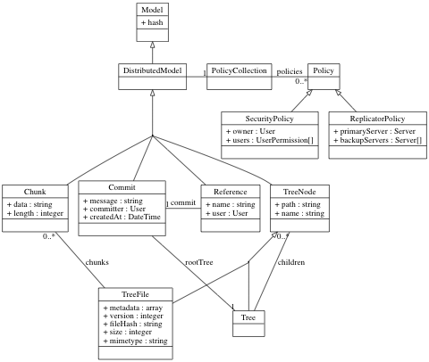

# Datenmodel

__TODO nur Notizen__
In diesem Kapitel wird das Datenmodel für die Datenhaltung behandelt. Es sollte alle Anforderungen an das Projekt erfüllen, um eine optimale und effiziente Datenhaltung zu gewährleisten.



Das Datenmodell ist an GIT angelehnt. Details zu diesem Model kann in der Abbildung \ref{data_model} begutachtet werden.

## Exkurs: GIT

GIT[^60] ist ein verteilte Versionsverwaltung, das ursprünglich entwickelt wurde, um den Source-Code des Linux Kernels zu verwalten.


Die Software ist im Grunde eine Key-Value Datenbank. Es werden Objekte in Form einer Datei abgespeichert, in dem jeweils der Inhalt des Objekts abgespeichert wird. Der Name der Datei enthält den Key des Objektes. Dieser Key wird berechnet indem ein sogenannter SHA berechnet wird. Der SHA ist ein mittels Secure-Hash-Algorith berechneter Hashwert der Daten. Das Listing \ref{git:calc_hash} zeigt, wie ein SHA in einem Terminal berechnet werden kann.

```{caption="Berechnung des SHA eines Objektes\label{git:calc_hash}" .bash}
$ OBJECT='blob 46\0{"name": "Johannes Wachter", "job": "Web-Developer"}'
$ echo -e $OBJECT | shasum
6c01d1dec5cf5221e86600baf77f011ed469b8fe -
```

Im Listing \ref{git:create_object_blob} wird ein GIT-Objekt vom Typ BLOB erstellt und in den `objects` Ordner geschrieben. 

```{caption="Erzeugung eines GIT-BLOB\label{git:create_object_blob}" .bash}
$ OBJECT='blob 46\0{"name": "Johannes Wachter", "job": "Web-Developer"}'
$ echo -e $OBJECT | git hash-object -w --stdin
6c01d1dec5cf5221e86600baf77f011ed469b8fe
$ find .git/objects -type f
    .git/objects/6c/01d1dec5cf5221e86600baf77f011ed469b8fe
```

Die Objekte in GIT sind immutable, also nicht veränderbar. Ein einmal erstelltes Objekt wird nicht mehr aus der Datenbank gelöscht. Bei der Änderung eines Objektes wird ein neues Objekt mit einem neuen Key erstellt.

### Objekt Typen

GIT kennt folgende Typen:

Ein BLOB

:   repräsentiert eine einzelne Datei in GIT. Der Inhalt der Datei wird in einem Objekt gespeichert. Bei Änderungen ist GIT auch in der Lage Inkrementelle DELTA-Dateien zu speichern. Beim wiederherstellen werden diese DELTAs der Reihe nach aufgelöst. Ein BLOB besitzt für sich gesehen keinen Namen.

Der TREE

:   beschreibt ein Ordner im Repository. Ein TREE enthält andere TREE bzw. BLOB Objekte und definiert damit eine Ordnerstruktur. In einem TREE werden auch die Namen zu BLOB und TREE Objekten festgelegt.

Der COMMIT

:   ist ein Zeitstempel eines einzelnen TREE Objektes. Im folgenden Listing \ref{git:commit_listing} ist der Inhalt eines COMMIT Objektes auf einem Terminal ausgegeben.

```{caption="Inhalt eines COMMIT Objektes\label{git:commit_listing}" .bash .numberLines}
$ git show -s --pretty=raw 6031a1aa
commit 6031a1aa3ea39bbf92a858f47ba6bc87a76b07e8
tree 601a62b205bb497d75a231ec00787f5b2d42c5fc
parent 8982aa338637e5654f7f778eedf844c8be8e2aa3
author Johannes Wachter <johannes.wachter@massiveart.at> 1429190646 +0200
committer Johannes Wachter <johannes.wachter@massiveart.at> 1429190646 +0200

    added short description gridfs and xtreemfs
```

Das Objekt enthält folgende Werte:

| Zeile | Name | Beschreibung |
|------|-----|-----|
| 2 | commit | SHA des Objektes |
| 3 | tree | TREE-SHA des Stammverzeichnisses |
| 4 | parent(s) | Ein oder mehrere Vorgänger |
| 5 | author | Verantwortlicher für die Änderungen |
| 6 | committer | Ersteller des COMMITs |
| 8 | comment | Beschreibung des COMMITs |

__Anmerkungen:__

* Ein COMMIT kann mehrere Vorgänger haben wen sie zusammengeführt werden. Zum Beispiel würde dies bei einem MERGE verwendet werden.
* Der Autor und Ersteller des COMMITs können sich unterscheiden, wenn zum Beispiel ein Benutzer einen PATCH erstellt ist er der Verantwortliche für die Änderungen. Der Benutzer, der den Patch nun auflöst und den `git commit` Befehl ausführt, ist der Ersteller.

Eine REFERENCE

:   ist ein Verweis auf einen bestimmten COMMIT. Aufbauend auf diese Verweise, ist das Branching-Model von GIT aufgebaut.

![Beispiel eines Repositories\label{git:data-model-example} [@chacon2015git]](images/git-data-model-example.png)

### Anforderungen

Das Datenmodell von GIT erfüllt folgende Anforderungen von Symcloud:

Versionierung

:   Durch die Commits können Versionshistorien einfach abgebildet werden und diese effizient durchsucht werden. Will ein Benutzer sehen, wie sein Dateibaum vor ein paar Wochen ausgehen hat, kann das System nach einem geeigneten Commit durchsuchen (anhand der Erstellungszeit) und anstatt des neuesten Commits, diesen Commit für die weiteren Datenbankabfragen verwenden.

Shares (__TODO besserer Name, verwende Begriff aus Kapitel \ref{specification}__)

:   Mit den Referenzen, können für jeden Benutzer mehrere Namensräume geschaffen werden. Jeder dieser Namensräume erhält einen eigenen Dateibaum und kann von mehreren Benutzern verwendet werden. Damit können Shares einfach abgebildet werden. Jede Referenz kann später auch für Benutzer eigene Berechtigungen erhalten und dadurch eine Art ACL eingerichtet werden.

Symlinks

:   Ebenfalls mit den Referenzen, können sogenannte Symlinks erstellt werden. Diese Symlinks werden im System verwendet, um Shares an einer bestimmten Stelle des Dateibaums eines Benutzers zu platzieren.

### Zusammenfassung

__TODO Zusammenfassung GIT Datenmodel__

Vorteil der immutable (nicht veränderbaren) Datenpakete ist das Caching, das auf jeder Maschine durchgeführt werden kann, ohne ein PURGE zu benötigen, da sich Objekte in der Datenbank nicht ändern sondern nur neue dazu kommen. Dies gilt für alle Objekte in diesem Model außer Referenzen. Diese müsse bei jedem Zugriff aus der Datenbank geladen werden.

## Details (__TODO Bessere Überschrift__)

Jedoch muss es für die Speicherung in einer NoSQL Datenbank leicht angepasst werden.

__TODO konzept des Dateimodels__


[^60]: <http://git-scm.com/>
