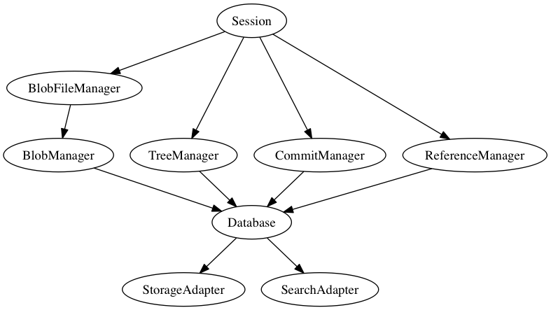
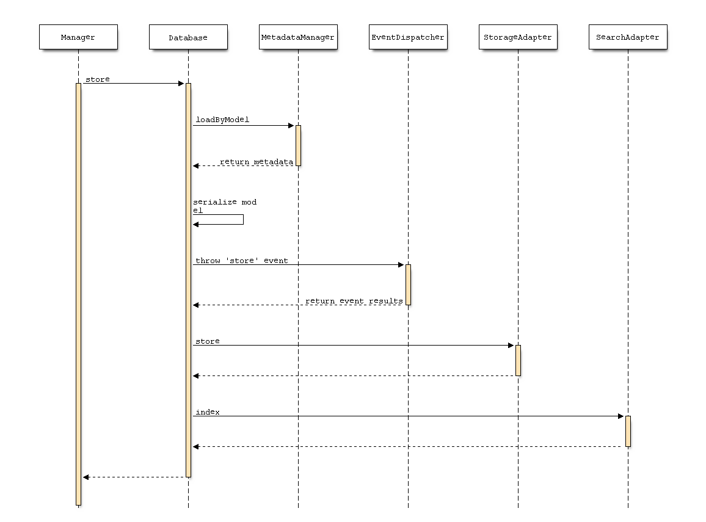
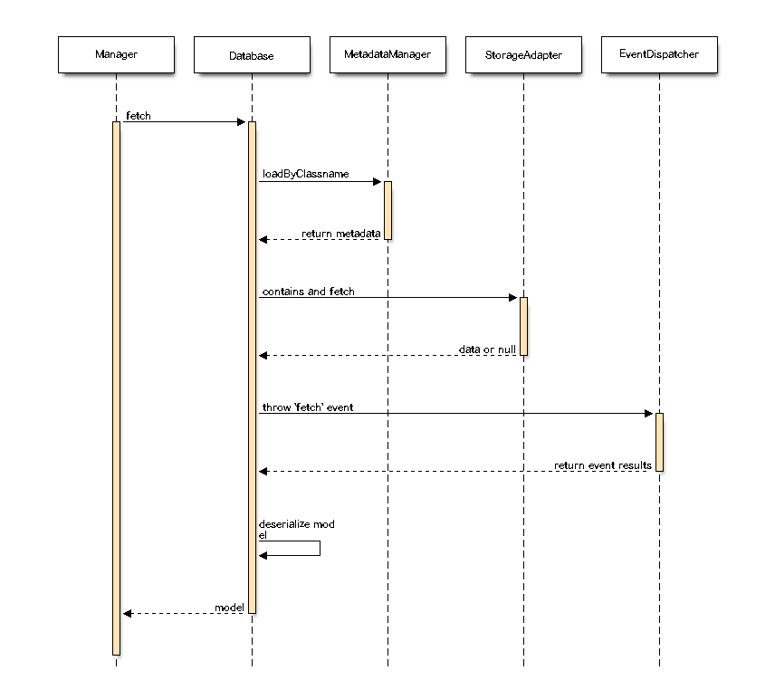
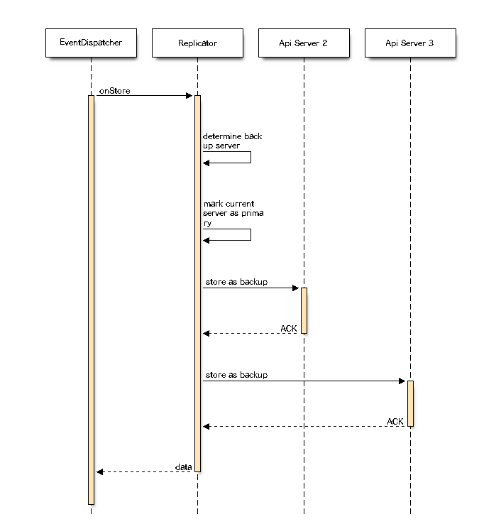
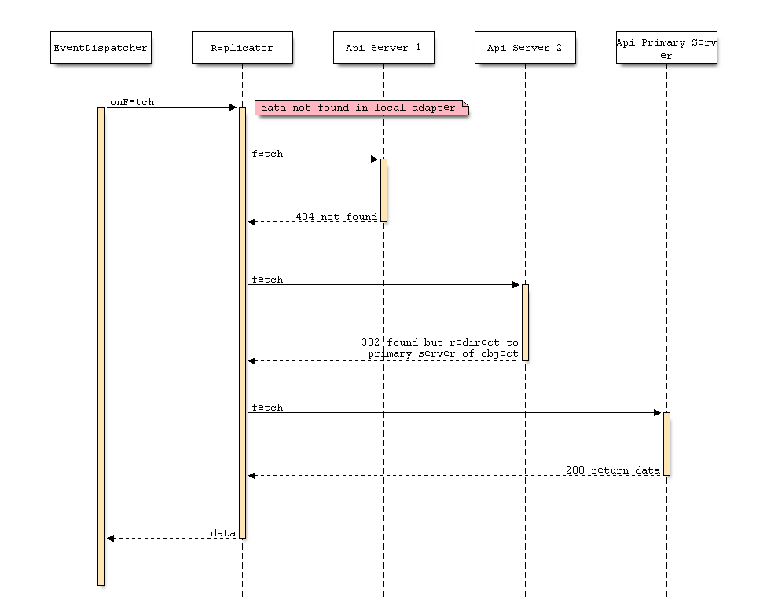
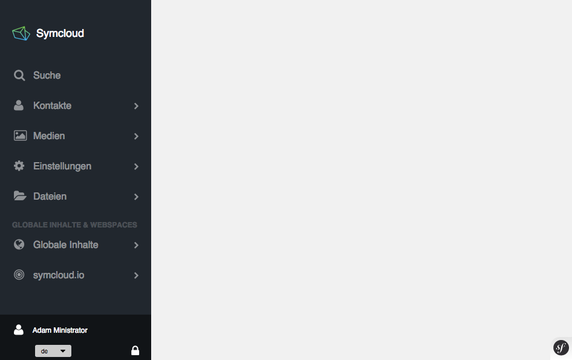
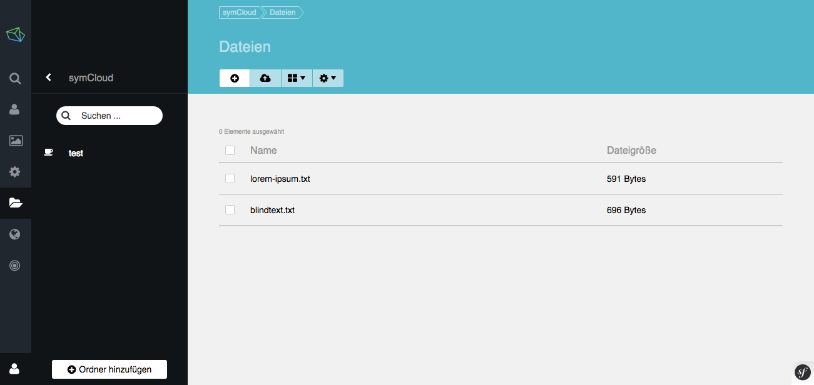
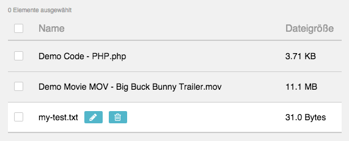
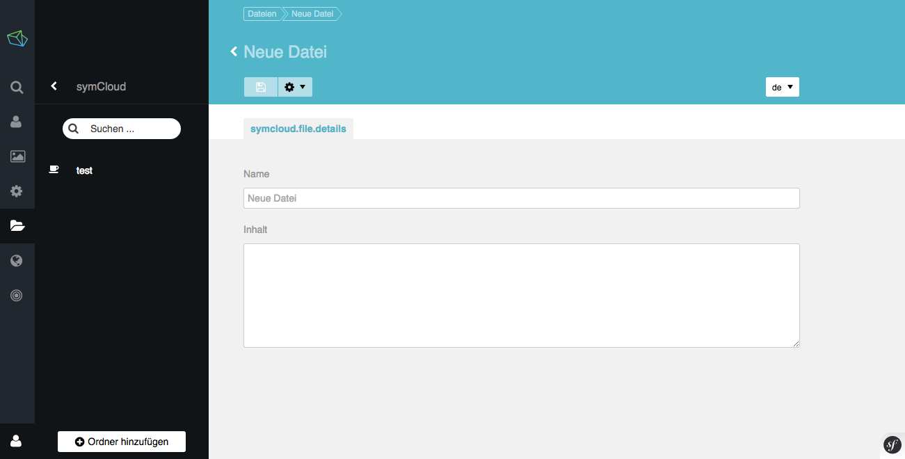
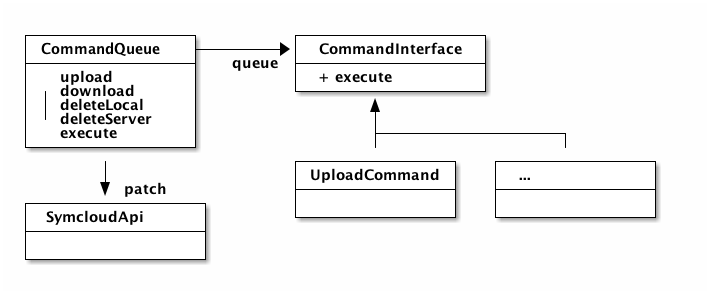

# \label{chapter_implementation}Implementierung

In diesem Kapitel werden die einzelnen Komponenten, die für symCloud entwickelt wurden, genauer betrachtet. Es entstand während der Entwicklungsphase ein einfacher Prototyp, mit dem die Funktionsweise des im vorherigen Kapitel beschriebenen Konzeptes, gezeigt werden konnte.

Dabei sind drei wichtige Komponenten entstanden:

Bibliothek (distributed-storage)

:   Die Bibliothek ist der Kern der Applikation und implementiert große Teile des Konzeptes von symCloud. Sie baut auf modernen Web-Technologien auf und verwendet einige Komponenten des PHP-Frameworks Symfony2[^64]. Dieses Framework ist eines der beliebtesten Frameworks in der Open-Source Community von PHP.

Plattform (symCloud)

:   Die Plattform bietet neben der REST-API auch ein einfaches UI an, mit dem es möglich ist, im Browser seine Dateien zu verwalten. Als Basis verwendet symCloud die Content-Management-Plattform SULU[^65] der Vorarlberger Firma MASSIVE ART WebServices GmbH[^66] aus Dornbirn. Diese Plattform bietet ein erweiterbares Admin-UI, eine Benutzerverwaltung und ein Rechtesystem an. Diese Features ermöglichen symCloud eine schnelle Entwicklung der Oberfläche und deren zugrundeliegenden Services.

Synchronisierungsprogramm (jibe)

:   Das Synchronisierungsprogramm ist ein Konsolen-Tool, mit dem es möglich ist, Dateien aus einem Ordner mit dem Server zu synchronisieren. Es dient als Beispiel für die Verwendung der API mit einer externe Applikation.

Der Source-Code dieser drei Komponenten ist auf der beiliegenden CD (`/source`) oder auf Github <https://github.com/symcloud> zu finden.

## \label{chapter_implementation_distributed_storage}Distributed-Storage

Der Distributed-Storage ist der Kern der Anwendung und kann als Bibliothek in jede beliebige PHP-Anwendung integriert werden. Diese Anwendung stellt die Authentifizierung und die Rest-API zur Verfügung, um mit den Kern-Komponenten zu kommunizieren.



Der interne Aufbau der Bibliothek ist in vier Schichten (siehe Abbildung \ref{architecture_ds}) aufgeteilt.

Session

:   Zentrale Schnittstelle, die alle Manager vereint und einen gemeinsamen Zugriffspunkt bildet, um mit dem Storage zu kommunizieren.

Manager

:   Um die Komplexität der jeweiligen Objekte zu abstrahieren, implementieren die Manager die jeweilige Funktionalität, um mit diesen Objekten zu kommunizieren. Die Objekte sind dabei reine Daten-Container.

Database

:   Die Datenbank benutzt Mechanismen von PHP, um die Objekte zu serialisieren und zu speichern. Dabei kann über Metadaten festgelegt werden, welche Eigenschaften serialisiert bzw. welche Eigenschaften in der Suchmaschine indexiert werden. Beim laden der Daten aus der Datenbank, können mithilfe dieser Metadaten die Objekte wieder deserialisiert werden.

Adapter

:   Die Adapter dienen dazu, das Speichermedium bzw. die Suchmaschine zu abstrahieren. Durch die Implementierung eines Interfaces, kann jede beliebige Speichertechnologie bzw. Suchmaschine verwendet werden.

Die Datenbank ist durch den Einsatz von Events flexibel erweiterbar. Mithilfe dieser Events kann zum Beispiel die Replikator-Komponente folgende Abläufe realisieren.

Verteilung

:   Bei einem "store" Event verteilt der Replikator das Objekt auf die ermittelten Backupserver. Um die Einstellungen des Replikators zu persistieren fügt der Eventhandler eine "ReplicatorPolicy" an das Modell an. Diese "Policy" wird zusätzlich mit dem Modell persistiert.

Nachladen

:   Im Falle eines "fetch" Events, werden fehlende Daten von den bekannten Servern nachgeladen. Dieses Event wird sogar dann geworfen, wenn die Daten im lokalen "StorageAdapter" nicht vorhanden sind. Dies erkennt der Replikator und fragt bei allen bekannten Servern an, ob sie dieses Objekt kennen. Dies gilt für die Replikationstypen "Permission" und "Full". Über einen ähnlichen Mechanismus kann der Replikationstyp "stub" realisiert werden. Der einzige Unterschied ist, dass die Backupserver den primary Server kennen und nicht alle bekannten Server durchsuchen müssen.

### Objekte speichern

Der Mittelpunkt des Speicher-Prozesses (siehe Abbildung \ref{database_store}) ist die Serialisierung zu Beginn. Hierfür werden die Metadaten des Objekts anhand seiner Klasse aus dem "MetadataManager" geladen und anhand dieser Informationen serialisiert. Diese Daten werden mit dem "EventDispatcher" aus dem Symfony2 Framework in einem Event zugänglich gemacht. Die Eventhandler haben die Möglichkeit die Daten zu bearbeiten und "Policies" zu dem Model zu erstellen. Abschließend werden die Daten zuerst mithilfe des "StorageAdapter" persistiert und durch den "SearchAdapter" in den Suchmaschinenindex aufgenommen. Um verschiedene Objekttypen voneinander zu trennen und eigene Namensräume zu schaffen, geben die Metadaten der Klasse, einen eindeutigen Kontext zurück. Dieser Kontext wird den Adaptern übergeben, um Kollisionen zwischen den Datensätzen zu verhindern.

\landscapestart



\landscapeend

### Objekte abrufen

Wie zu erwarten ist der Abruf-Prozess (siehe Abbildung \ref{database_fetch}) von Daten ein Spiegelbild des Speicherprozesses. Zuerst wird versucht, mit dem Kontext des Objektes die Daten aus dem "Storage" zu laden. Diese Daten werden durch den "EventDispatcher" dem Eventhandler zur Verfügung gestellt. Diese haben die Möglichkeit, zum Beispiel fehlende Daten nachzuladen, Änderungen an der Struktur der Daten durchzuführen oder den Prozess abzubrechen, wenn keine Rechte vorhanden sind dieses Objekt zu lesen. Diese veränderten Daten werden abschließend für den Deserialisierungsprozess herangezogen.

\landscapestart



\landscapeend

Die beiden Abläufe, um Objekte zu speichern und abzurufen, beschreiben eine lokale Datenbank, die die Möglichkeit bietet, über Events die Daten zu verändern oder anderweitig zu verwenden. Sie ist unabhängig vom Datenmodell von symCloud und könnte für alle möglichen Objekte verwendet werden. Daher ist symCloud auch für künftige Anforderungen gerüstet.

### Replikator

Wie schon erwähnt, verwendet der Replikator Events, um die Prozesse des Ladens und Speicherns von Daten zu beeinflussen und damit die verteilten Aspekte für die Datenbank umzusetzen. Dabei implementiert der Replikator eine einfache Version des primärbasierten Protokolls. Für diesen Zweck wird der Replikator mit einer Liste von verfügbaren Servern initialisiert. Auf Basis dieser Liste werden die Backupserver für jedes Objekte ermittelt.

Wie schon im Kapitel \ref{chapter_concept_database} erwähnt, gibt es verschiedene Arten die Backupserver für ein Objekt zu ermitteln. Implementiert wurde neben dem Typ "Full" auch ein automatisches "Lazy"-Nachladen für fehlende Objekte. Dieses Nachladen ist ein wesentlicher Bestandteil der beiden anderen Typen ("Permission" und "Stub").

__Full__

Bei einem "store" Event werden die Backupserver per Zufall aus der Liste der vorhandenen Server ausgewählt und der Server, der das Objekt erstellt, als primäry Server markiert. Anhand der Backupserver-Liste werden die Daten an die Server verteilt. Dazu werden der Reihe nach die Daten an die Server versendet und auf eine Bestätigung gewartet. Falls einer dieser Server nicht erreichbar ist, wird dieser ausgelassen und ein anderer Server als Backup herangezogen. Damit wird der konsistente Zustand der Datenbank verifiziert. Abschließend wird die erstellte "Policy" zu den Daten hinzugefügt, damit sie mit den Daten persistiert wird und später wiederverwendet werden kann. Dieser Prozess wird in der Abbildung \ref{replicator_full} visualisiert.

\landscapestart



\landscapeend

__Lazy__

Um fehlende Daten im lokalen Speicher nachzuladen, werden der Reihe nach alle bekannten Server abgefragt. Dabei gibt es vier mögliche Antworten (siehe Abbildung \ref{replicator_lazy}), auf die der Replikator reagieren kann. Der Status kann anhand des HTTP-Status-Codes erkannt werden.

404

:   Das Objekt ist auf dem angefragten Server nicht bekannt.

302

:   Das Objekt ist bekannt, aber der angefragte Server ist nur als Backupserver markiert. Dieser Server kennt allerdings die genaue Adresse des primary Servers und leitet auf diesen weiter.

403

:   Das Objekt ist bekannt und der angefragte Server als primary Server für dieses Objekt markiert. Der Server überprüft die Zugangsberechtigung, weil diese aber nicht gegeben ist, wird der Zugriff verweigert. Der Replikator erkennt, dass der Benutzer nicht berechtigt ist, die Daten zu lesen und verweigert den Zugriff.

200

:   Wie bei 403 ist der angefragte Server, der primary Server des Objektes, aber der Benutzer ist berechtigt das Objekt zu lesen und der Server gibt direkt die Daten zurück. Diese Daten dürfen auch gecached werden. Die Berechtigungen für andere Benutzer werden direkt mitgeliefert, um später diesen Prozess nicht noch einmal ausführen zu müssen. 

\landscapestart



\landscapeend

Mithilfe dieses einfachen Mechanismuses kann der Replikator Daten von anderen Servern nachladen, ohne zu wissen, wo sich die Daten befinden. Dieser Prozess bringt allerdings Probleme mit sich. Zum Beispiel muss jeder Server angefragt werden, bevor der Replikator endgültig sagen kann, dass das Objekt nicht existiert. Dieser Prozess kann daher bei einem großen Netzwerk sehr lange dauern. Dieser Fall sollte allerdings aufgrund des Datenmodells nur selten vorkommen, da Daten nicht gelöscht werden und daher keine Deadlinks entstehen können.

### Adapter

Für die Abstrahierung des Speichermediums verwendet die Datenbank das Adapter-Pattern. Mithilfe dieses Patterns, kann jede symCloud-Installation sein eigenes Speichermedium verwenden. Dabei gibt es zwei Arten von Adaptern:

Storage

:   Der "StorageAdapter" wird verwendet, um serialisierte Objekte lokal zu speichern oder zu laden. Er implementiert im Grunde einen einfachen Befehlssatz: `store`, `fetch`, `contains` und `delete`. Jeder dieser Befehle erhält, neben anderen Parametern, einen Hash und einen Kontext. Der Hash ist sozusagen der Index des Objektes. Der Kontext wird verwendet, um Namensräume für die Hashes zu schaffen. Dies implementiert der Dateisystemadapter, indem er für jeden Kontext einen Ordner erstellt und für jeden Hash eine Datei. So kann schnell auf ein einzelnes Objekt zugegriffen werden.

__TODO Beispiel__

Search

:   Der "SearchAdapter" wird verwendet, um die Metadaten zu den Objekten zu indexieren. Dies wird benötigt, wenn die Daten durchsucht werden. Jeder "SearchAdapter" implementiert folgende Befehle: `index`, `search` und `deindex`. Wobei auch hier mit Hash und Kontext gearbeitet wird. Über den Suchbefehl, können alle oder bestimmte Kontexte durchsucht werden. Für die Entwicklung des Prototypen wurde die Bibliothek Zend-Search-Lucene[^67] verwendet, da diese ohne weitere Abhängigkeiten verwendet werden kann.

Bei der Verwendung des Replikators gibt es einen zusätzlichen Adapter, der mithilfe der Server-Informationen mit dem Remoteserver kommunizieren kann. Dieser Adapter implementiert den Befehlssatz: `fetch` und `store`.

Die Adapter sind Klassen, die die Komplexität des Speichermediums bzw. der API von der restlichen Applikation trennen, um dadurch die Bibliothek unabhängig von der Applikation implementieren zu können.

### Manager

Die Manager sind die Schnittstelle, um mit den einzelnen Schichten des Datenmodells zu kommunizieren. Jeder dieser Manager implementiert ein "Interface" mit dem es möglich ist, mit den jeweiligen Datenobjekten zu interagieren. Grundsätzlich sind dies Befehle, um ein Objekt zu erstellen oder abzufragen. Im Falle des "ReferenceManager" oder "TreeManager" bieten sie auch die Möglichkeit, Objekte zu bearbeiten. Der "ReferenceManager" bearbeitet dabei auch wirklich ein Objekt in der Datenbank, indem er es einfach überschreibt. Diese Operation ist, durch den Replikationstyp "Stub", auch in einem verteilten Netzwerk möglich. Der "TreeManager" klont das Objekt und erstellt unter einem neuen Hash ein neues Objekt, sobald es mit einem Commit zusammen persistiert wird.

### Zusammenfassung

Die Bibliothek "Distributed-Storage" bietet eine einfache und effiziente Implementierung des in Kapitel \ref{chapter_concept} beschriebenen Konzeptes. Es baut auf eine erweiterbare Hash-Value Datenbank auf. Diese Datenbank wird mittels eines Eventhandlers (Replikator) zu einer verteilten Datenbank. Dabei ist es für die Datenbank irrelevant, welcher Transportlayer oder welches Protokoll verwendet wird. Dieser kann neben HTTP, jeden beliebigen anderen Transportlayer verwenden. Der konsistente Zustand der Datenbank kann mittels Bestätigungen bei der Erstellung, blockierenden Vorgängen und nicht löschbaren Objekten garantiert werden. Nicht veränderbare Objekte lassen sich dauerhaft und ohne Updates verteilen. Alle anderen Objekte können so markiert werden, dass sie immer bei einem primary Server angefragt werden müssen und nur für die Datensicherheit an die Backupserver verteilt werden.

## \label{chapter_implementation_platform}Plattform

Die Plattform bzw. die Anwendung stellt die Rest-API und die Authentifizierung zur Verfügung. Dies ermöglicht der Bibliothek die Kommunikation mit anderen Servern und Applikationen. Zusätzlich beinhaltet sie die Oberfläche, um mit den Daten in einem Browser zu interagieren.

### Authentifizierung

Die Authentifizierung und die Benutzerverwaltung stellt die Plattform SULU zur Verfügung. Hierfür wird der "UserProvider" von SULU dem "Distributed-Storage" bekannt gemacht. Allerdings stellt die Plattform nur eine Authentifizierung mittels HTML-Formular (Benutzername und Passwort) oder HTTP-Basic standardmäßig zur Verfügung. Um die Verwendung der API auch für Dritt-Entwickler Applikationen zu ermöglichen, wurde das Protokoll OAuth2 in SULU integriert. Eine genauere Beschreibung dieses Protokolls wird im Kapitel \ref{implementation_oauth} gegeben.

Eine Autorisierung zwischen den Servern ist momentan nicht vorgesehen. Dies wurde in der ersten Implementierungsphase nicht umgesetzt, wäre aber für eine produktiven Einsatz unerlässlich.

### Rest-API

Die Rest-API ist, wie schon im Kapitel \ref{chapter_concept_rest_api} beschrieben, in vier verschiedene Schnittstellen aufgeteilt. Dabei werden die SULU-internen Komponenten verwendet, um die Daten für die Übertragung zu serialisieren und RESTful[^68] aufzubereiten. Für eine verteilte Installation implementiert die Plattform den "ApiAdapter", um die Rest-API für die Bibliothek, zu abstrahieren.

### Benutzeroberfläche

Die Architektur der Benutzeroberfläche von SULU ist als "Single-Page-Application" ausgeführt. In dieser Architektur, die Oberfläche der Website ist aus individuellen Komponenten zusammengesetzt, die unabhängig aktualisiert und ersetzt werden kann [@mesbah2007spi]. Das bedeutet, dass die Oberfläche aus nur einem klassischem Request aufgebaut wird. In diesem ist die Grundstruktur definiert und die Grundlegenden JavaScript Dateien eingebunden. Dieses Scripts laden dann alle anderen JavaScript Dateien nach, die die Oberfläche Stück für Stück zusammensetzt.



In der Abbildung \ref{sulu_basic_ui} ist der Grundlegende Aufbau des Sulu-UI zu erkennen. Im Rechten ist eine Erweiterbare Navigation, die bereits den Symcloud Punkt "Dateien enthält", und in Linken Bereich ist der sogenannte "Content"-Bereich. Dieser Bereich kann von den nachgeladenen Komponenten gefüllt werden. Um das UI einheitlich zu gestalten, bietet SULU vordefinierte Komponenten an, die zum Beispiel eine Liste abstrahieren. Dieser Listen-Komponente wird im Grunde eine URL übergeben, unter welcher die Daten heruntergeladen werden können. Die Liste generiert daraufhin eine Tabelle mit den Daten aus dem Response der angegeben URL (siehe Abbildung \ref{sulu_symcloud_file_list}).



Über der Liste ist eine Toolbar, über die neue Dateien erstellt werden können. Über die beiden anderen Schaltflächen, lässt sich die Ansicht der Liste (Reihenfolge und Sichtbarkeit der Spalten bzw. Umschalten zwischen Listen- und Vorschaubildansicht) verändern. Um Dateien zu löschen oder zu bearbeiten erscheinen bei neben dem Namen zwei Schaltflächen, wenn die Maus über den Namen bewegt wird (siehe Abbildung \ref{sulu_symcloud_edit_file}).



Das Formular für neue Dateien ist einfach gestaltet. Es bietet zwei Formularfelder, mit denen der Name und Inhalt der Datei bearbeitet werden kann. Mit dem selben Formular können Dateien auch bearbeitet werden.



### Zusammenfassung

Die Plattform ist ein reiner Prototyp, der zeigen soll, ob das Konzept (aus dem Kapitel \ref{chapter_concept}) funktionieren kann. Es bietet in den Grundzügen alle Funktionen an, um zu einem späteren Zeitpunkt[^40] diesen Prototypen zu einer vollständigen Plattform heranwachsen zu lassen.

## Synchronisierungsprogramm: Jibe

Jibe ist das Synchronisierungsprogramm zu einer symCloud-Installation. Es ist ein einfaches PHP-Konsolen Tool, mit dem es möglich ist, Daten aus einer symCloud-Installation mit einem Endgerät zu synchronisieren. Das Programm wurde mithilfe der Symfony Konsole-Komponente[^60] umgesetzt. Diese Komponente ermöglicht eine schnelle und unkomplizierte Entwicklung solcher Konsolen-Programme.

Ausgeliefert wird das Programm in einem sogenannten PHAR-Container[^61]. Dieser Container enthält alle benötigten Source-Code- und Konfigurationsdateien. Das Format ist vergleichbar mit dem JAVA-Container JAR. PHAR-Container werden in der PHP-Gemeinschaft oft verwendet, um komplexe Applikationen, wie zum Beispiel PHPUnit[^62] (ein Test Framework für PHP) auszuliefern.

Über den ersten Parameter kann spezifiziert werden, welches Kommando ausgeführt werden soll. Alle weiteren Parameter sind Argumente für das angegebene Kommando. Über den Befehl `php jibe.phar sync` kann der Synchronisierungsvorgang gestartet werden.

```{caption="Ausführen des 'configure' Befehls\label{jibe_configure_listing}" .bash}
$ php jibe.phar configure
Server base URL: http://symcloud.lo
Client-ID: 9_1442hepr9cpw8wg8s0o40s8gc084wo8ogso8wogowookw8k0sg
Client-Secret: 4xvv8pn29zgoccos0c4g4sokw0ok0sgkgkso04408k0ckosk0c
Username: admin
Password:
```

Im Listing \ref{jibe_configure_listing} ist die Ausführung des "Konfigurieren"-Kommandos dargestellt. Argumente können sowohl an den Befehl angehängt werden oder durch den Befehl abgefragt werden. Eine Validierung von zum Beispiel der URL, kann direkt in einem Kommando implementiert werden.

Diese Kommandos stehen dem Benutzer zur Verfügung:

configure

:   Konfiguriert den Zugang zu einer symCloud-Installation. Falls notwendig koordiniert sich das Tool mit der Installation, um andere Informationen zu Repliken oder verbundenen Installationen, zu erhalten.

refresh-token

:   Aktualisiert das Access-Token von OAuth2. Dies ist notwendig, da die Access-Tokens über einen Ablaufzeitpunkt verfügen. Ist auch das Refresh-Token abgelaufen, muss der Befehl "configure" erneut ausgeführt werden.

status

:   Gibt den aktuellen Status des Access-Token auf der Konsole aus. Dieses Kommando wird standardmäßig aufgerufen, wenn kein anderes Kommando angegeben wurde.

sync

:   Startet den Synchronisierungsvorgang. Über die Option `-m` kann eine Nachricht zu dem erstellten Commit angefügt werden.

### Architektur



Der zentrale Bestandteil von Jibe ist eine "CommandQueue" (siehe Abbildung \ref{jibe_architecture}). Sie sammelt alle nötigen Kommandos ein und führt sie nacheinander aus. Diese "Queue" ist nach dem "Command-Pattern" entworfen. Folgende Befehle können dadurch aufgerufen werden:

Upload

:   Eine neue Datei auf den Server hochladen.

Download

:   Die angegebene Datei wird vom Server heruntergeladen und lokal an gespeichert.

DeleteServer

:   Die Datei wird auf dem Server gelöscht.

DeleteLocal

:   Die Lokale Datei wird gelöscht.

Aus diesen vier Kommandos lässt sich nun ein kompletter Synchronisierungsvorgang abbilden.

### Abläufe

Für einen kompletten Synchronisierungsvorgang werden folgende Informationen benötigt:

Lokale Hashwerte

:   Diese werden aus den aktuellen Dateibeständen generiert.

Zustand der Dateibestände

:   Der Zustand nach der letzten Synchronisierung. Wenn diese Hashwerte mit den aktuellen Hashwerten verglichen werden, kann zuverlässig ermittelt werden, welche Dateien sich geändert haben. Zusätzlich kann die Ausgangsversion der Änderung erfasst werden, um Konflikte zu erkennen.

Aktueller Serverzustand

:   enthält die aktuellen Hashwerte und Versionen aller Dateien, die auf dem Server bekannt sind. Diese werden verwendet, um zu erkennen, dass sich Dateien auf dem Server verändert haben bzw. gelöscht wurden.

Diese drei Informationspakete können sehr einfach ermittelt werden. Einzig und alleine der Zustand der Dateien muss nach einer Synchronisierung beim Client gespeichert werden, um diese beim nächsten Vorgang wiederzuverwenden.

Die Tabelle \ref{table_jibe_flow} gibt Aufschluss über die Erkennung von Kommandos aus diesen Informationen.

\landscapestart

|   | Hash          | Version | Description                                 | Download | Upload | Del L | Del S | Conflict |
|---|---------------|---------|---------------------------------------------|----------|--------|-------|-------|----------|
| 1 | (Z = X) = Y   | n = m   | Nothing to be done                          |          |        |       |       |          |
| 2 | (Z = X) != Y  | n < m   | Server file changed, download new version   | x        |        |       |       |          |
| 3 | (Z != X) != Y | n = m   | Client file change, upload new version      |          | x      |       |       |          |
| 4 | (Z != X) != Y | n < m   | Client and Server file changed, conflict    |          |        |       |       | x        |
| 5 | (Z = X) = Y   | n < m   | Server file changed but content is the same |          |        |       |       |          |
| 6 | X             |         | New client file, upload it                  |          | x      |       |       |          |
| 7 | Y             | m       | New server file, download it                | x        |        |       |       |          |
| 8 | X             | n       | Server file deleted, remove client version  |          |        | x     |       |          |
| 9 | Y             | n = m   | Client file deleted, remove server version  |          |        |       | x     |          |

  : Evaluierung der Zustände\label{table_jibe_flow}

\landscapeend

| Zeichen | Beschreibung |
|---|---|
| X | Lokaler Hashwert der Datei |
| Z | Lokaler Hashwert der Datei |
|   | bei der letzten Synchronisierung |
| Y | Remote Hashwert der Datei |
|   | bei der letzten Synchronisierung |
| n | Lokale Version der Datei |
| m | Remote Version der Datei |
| Del | Delete - Löschen |
| L | Local - Lokal |
| S | Server |

  : Legende zu Tabelle \ref{table_jibe_flow}

Nicht angeführte Werte in der Tabelle, sind zu dem Zeitpunkt nicht verfügbar bzw. nicht benötigt. Was zum Beispiel bedeutet, dass wenn der Lokale Hash nicht angeführt ist, die Datei nicht vorhanden ist (gelöscht oder noch nicht angelegt).

Beispiel der Auswertungen anhand des Falles Nummer vier (aus der Tabelle \ref{table_jibe_flow}):

1. Lokale Datei hat sich geändert: Alter Hashwert unterscheidet sich zu dem aktuellen.
2. Serverversion ist größer als lokale Version.
3. Aktueller und Server-Hashwert stimmen nicht überein.

Das bedeutet, dass sich sowohl die Serverdatei als auch die lokale Kopie geändert haben. Dadurch entsteht ein Konflikt, der aufgelöst werden muss. Das Auflösen solcher Konflikte ist nicht Teil dieser Arbeit, er wird allerdings im Kapitel \ref{outlook_conflict} kurz behandelt.

### Zusammenfassung

Der Synchronisierungsclient ist ein Beispiel dafür, wie die Rest-API von anderen Applikationen verwendet werden kann, um die Daten aus symCloud zu verwenden. Es wären viele verschiedene Anwendungsfälle denkbar.

In diesem Beispiel wurde auch die Komplexität des Synchronisierungsprozesses durchleuchtet und eine Lösung geschaffen, um schnell und effizient einen Ordner mit symCloud zu synchronisieren.

## Zusammenfassung

Die Prototypen Implementierung umfasst die wichtigsten Punkte des im vorherigen Kapitel verfassten Konzeptes. Es umfasst neben dem Datenmodell und der Datenbank, die in der Lage ist die Daten über eine Menge von Servern verteilen, auch eine einfache Plattform, mit der Dateien in einer einfachen Weboberfläche bearbeiten kann. Um die Dateien mit einem Endgerät zu synchronisieren wurde der Client Jibe implementiert. Der über ein einfache REST-API in der Lage ist die Dateien zu synchronisieren.

Vorgesehene aber nicht implementiert wurden die Bereiche:

* Zugriffskontrolle
* Replikationen auf Basis von Benutzerberechtigungen

Diese Bereiche können als Eventhandler implementiert werden. Alle dafür benötigten Komponenten sind vorhanden. Die Zugriffskontrollliste könnte als Policy zu jedem Objekt gespeichert werden. Auf Basis dieser Policy könnte sowohl der Replikator entscheiden welche Server Zugriff auf das Objekt besitzen, als auch ein Eventhandler entscheiden, ob das Objekt für den Benutzer, der das Objekt angefragt hat, verfügbar ist.

[^60]: <http://symfony.com/doc/current/components/console/introduction.html>
[^61]: <http://php.net/manual/de/intro.phar.php>
[^62]: <https://phpunit.de/>
[^63]: <http://tools.ietf.org/html/rfc5789#section-2.1>
[^64]: <http://symfony.com/>
[^65]: <http://www.sulu.io>
[^66]: <http://www.massiveart.com/de>
[^67]: <http://framework.zend.com/manual/1.12/de/zend.search.lucene.html>
[^68]: <http://restcookbook.com/>
