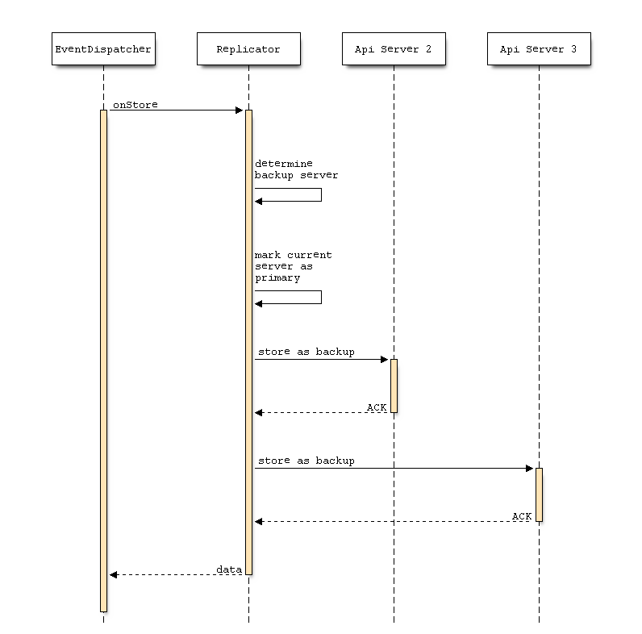

# Implementierung

In diesem Kapitel werden die einzelnen Komponenten, die für Symcloud entwickelt wurden, genauer betrachtet. Es entstand während der Entwicklungsphase ein einfacher Prototyp, mit dem die Funktionsweise des, im vorherigen Kapitel beschriebenen Konzeptes, gezeigt werden konnte.

Dabei sind drei wichtige Komponenten entstanden:

Die Bibliothek (distributed-storage)

:   ist der Kern der Applikation und implementiert große Teile des Konzeptes von Symcloud. Sie baut auf modernen Web-Technologien auf und verwendet einige Komponenten des PHP-Frameworks Symfony2[^64]. Dieses Framework ist eines der beliebtesten Frameworks in der Open-Source Community von PHP.

Die Plattform (symcloud)

:   bietet neben der REST-API auch ein einfaches UI an, mit dem es möglich ist, im Browser sein Dateien zu verwalten. Als Basis verwendet Symcloud die Content-Management-Plattform SULU[^65] der Vorarlberger Firma MASSIVE ART WebServices[^66] aus Dornbirn. Diese Plattform bietet ein erweiterbares Admin-UI, eine Benutzerverwaltung und ein Rechtesystem. Diese Features ermöglichen Symcloud eine schnelle Entwicklung der Oberfläche und deren zugrundeliegenden Services.

Der Client (jibe)

:   ist ein Konsolen-Tool, mit dem es möglich ist, Dateien aus einem Ordner mit dem Server zu synchronisieren. Es dient als Beispiel für die Verwendung der API mit einer externe Applikation.

Der Source-Code dieser drei Komponenten ist auf der Beiliegenden CD (`/source`) oder auf Github <https://github.com/symcloud> zu finden.

## Distributed-Storage

Distributed-Storage ist der Kern der Anwendung und kann als Bibliothek in eine beliebige PHP-Anwendung integriert werden. Diese Anwendung stellt dann die Authentifizierung und die Rest-API zur Verfügung, um mit den Kern-Komponenten zu kommunizieren.


Der interne Aufbau der Bibliothek ist in vier Schichten (siehe Abbildung \ref{architecture_ds}) aufgeteilt.

Session

:   Zentrale Schnittstelle die alle Manager vereint und einen gemeinsamen Zugriffspunkt bildet, um mit dem Storage zu kommunizieren.

Manager

:   Um die Komplexität der jeweiligen Objekte zu abstrahieren, implementieren die Manager die jeweilige Funktionalität um mit diesen Objekten zu kommunizieren. Die Objekte sind dabei reine Daten-Container.

Database

:   Die Datenbank benutzt einfache Mechanismen, um die Objekte zu serialisieren und zu speichern. Dabei können über einen Metadaten festgelegt werden, welche Eigenschaften serialisiert werden bzw. welche Eigenschaften in der Suchmaschine indexiert werden. Beim laden der Daten aus der Datenbank, können mithilfe dieser Metadaten die Objekte wider deserialisiert werden.

Adapter

:   Die Adapter dienen dazu, das Speichermedium bzw. die Suchmaschine zu abstrahieren. Durch die Implementierung eines Interfaces, kann jede beliebige Speichertechnologie bzw. Suchmaschine verwendet werden.

Die Datenbank ist durch den Einsatz von Events flexibel erweiterbar. Mithilfe dieser Event kann zum Beispiel die Replikator-Komponente folgende Abläufe realisieren.

Verteilung

:   Bei einem "store" Event, verteilt der Replikator das Objekt auf die ermittelten Backup-Server. Um die Einstellungen des Replikators zu persistieren, fügt der Event-Handler eine ReplicatorPolicy an das Model an. Diese Strategie wird dann zusätzlich mit Model persistiert.

Nachladen

:   Im Falle eines "fetch" Events, werden fehlende Daten von den bekannten Servern nachgeladen. Dieses Event wird sogar dann geworfen, wenn die Daten in der lokalen Datenbank nicht vorhanden sind. Dies erkennt der Replikator und beginnt alle bekannten Servern anzufragen, ob sie dieses Objekt kennen. Über einen ähnlichen Mechanismus kann der Replikationstyp "stub" realisiert werden. Der einzige unterschied ist, dass die Backupserver den Primary-Server kennen und nicht alle bekannten Server durchsuchen müssen.

### Objekte speichern

Der Mittelpunkt des Speicher-Prozesses (siehe Abbildung \ref{database_store}) ist die Serialisierung zu Beginn. Hierfür werden die Metadaten des Models anhand seiner Klasse aus dem "MetadataManager" geladen und anhand dieser Informationen serialisiert. Diese Daten werden mithilfe des "EventDispatcher", aus dem Symfony2 Framework, in einem Event zugänglich gemacht. Die Eventhandler haben, die Möglichkeit die Daten zu bearbeiten und Strategien zu dem Model zu erstellen. Abschließend werden die Daten zuerst mithilfe des "StorageAdapter" persistiert und mithilfe des "SearchAdapter" in den Suchmaschinenindex aufgenommen.


### Objekte abrufen

Wie zu erwarten, ist der Abruf-Prozess von Daten, ein Spiegelbild des Speicher-Prozesses. Zuerst wird versucht mithilfe der Klassenmetadaten die Daten aus dem Storage zu laden. Diese Daten werden mithilfe des "EventDispatcher" den Handler zur Verfügung gestellt. Diese haben dann die Möglichkeit zum Beispiel fehlende Daten nachzuladen oder Änderungen an der Struktur durchzuführen. Diese veränderten Daten werden abschließend für den Deserialisierungs-Prozess herangezogen.


\newpage

Diese beiden Abläufe beschreiben eine lokale Datenbank, die die Möglichkeit bietet über Events die Daten zu verändern oder zu verwenden. Sie ist unabhängig zum Datenmodell von Symcloud und könnte für alle möglichen Objekte verwendet werden. Daher ist Symcloud auch für künftige Anforderungen gerüstet. Geplant ist auch der Release Datenbank herausgelöst aus der Bibliothek um sie anderen Projekten zur Verfügung zu stellen.

### Replikator

Wie schon erwähnt, verwendet der Replikator Events, um die Prozesse des Ladens und Speicherns von Daten zu beeinflussen und damit die Verteilte Aspekte für die Datenbank umzusetzen. Dabei implementiert der Replikator eine einfache Version des Primärbasierten Protokolls. Für diesen Zweck wird der Replikator mit einer Liste von verfügbaren Servern initialisiert. Auf Basis dieser Liste werden die Backup-Server für die Objekte ermittelt.

Wie schon im Kapitel \ref{chapter_concept_database} erwähnt, gibt es verschiedene Arten die Backup-Server für ein Objekt zu ermitteln. Implementiert wurde neben dem Typ "Full" auch ein automatisches "Lazy"-Nachladen für fehlende Objekte. Dieses Nachladen ist ein wesentlicher Bestandteil der beiden anderen Typen.

__Full__



__TODO beschreibung__

__Lazy__


__TODO beschreibung__


__TODO Liste von Themen:__

* Distributed Storage:
  * Dateimodell
    * Referenzen
    * Symlinks
    * Versionierung
  * Datenbank Abstraktion:
    * Warum Riak und nicht GridFS, S3 oder XtreemFS?
    * Beschreibung und Ansätze um einen "Lokalen" Adapter zu implementieren
  * Sync-Client Abläufe und Implementierung
  * Verteilte Aspekte
    * Replikationen
    * Lock-Mechanismen
    * Autorisierung

## OAuth2\label{implementation_oauth}

Für die Authentifizierung wurde das Protokoll OAuth in der Version 2 implementiert. Dieses offene Protokoll erlaubt eine standardisierte, sichere API-Autorisierung für Desktop, Web und Mobile-Applikationen. Initiiert wurde das Projekt von Blaine Cook und Chris Messina. [@wikioauth]

Der Benutzer kann einer Applikation den Zugriff auf seine Daten autorisieren, die von einer andere Applikation zur Verfügung gestellt wird. Dabei werden nicht alle Details seiner Zugangsdaten preisgegeben. Typischerweise wird die Weitergabe eines Passwortes an Dritte vermieden. [@wikioauth]

### Begriffe

In OAuth2 werden folgende vier Rollen definiert:

Resource owner

:   Besitzer einer Ressource, die er für eine Applikation bereitstellen will.

Resource server

:   Der Server, der die Geschützen Ressourcen verwaltet. Er ist in der Lage Anfragen zu akzeptieren und die geschützten Ressourcen zurückzugeben, wenn ein geeignetes und valides Token bereitgestellt wurde.

Client

:   Die Applikation stellt Anfragen, im Namen des Ressourceneigentümers, an den sesource server. Sie holt sich vorher die Genehmigung zu diesen geschützten Ressourcen.

Authorization server

:   Der Server, der Zugriffs-Tokens, nach der erfolgreichen Authentifizierung des Ressourceneigentümers, bereitstellt.

Scopes

:   TODO

Die Interaktion zwischen "Resource server" und "Authorization server" ist nicht spezifiziert. Der Autorisierungsserver und Ressourcenserver können auf dem selben Server bzw. in der selben Applikation betrieben werden. Eine andere Möglichkeit wäre es, dass die beiden Server auf verschiedenen Server zu betreiben. Ein Autorisierungsserver kann auch Zugriffstoken für mehrere Ressourcenserver bereitstelle. [@hardt2012oauth, Seite 5]

### Protokoll Ablauf


Der Ablauf einer Autorisierung [@hardt2012oauth, Seiten 6 ff] mittels Oauth2, der in der Abbildung \ref{oauth_flow} abgebildet ist, enthält folgende Schritte:

A) Der Client fordert die Genehmigung des "Resource owner". Diese Anfrage kann direkt an den Benutzer gemacht werden (wie in der Abbildung dargestellt) oder vorzugsweise indirekt über den "Authorization server" (wie zum Beispiel bei Facebook).
B) Der Client erhält einen "authorization grant". Er repräsentiert die Genehmigung des "Resource owner" die geschützten Ressourcen zu verwenden.
C) Der Client fordert einen Token beim "Autorization server" mit dem "authorization grant" an.
D) Der "Autorization server" authentifiziert den Client, validiert den "authorization grant" und gibt einen Token zurück.
E) Der Client fordert eine geschützte Ressource und autorisiert die Anfrage mit dem Token.
F) Der "Resource server" validiert den Token, validiert ihn und gibt die Ressource zurück.

### Anwendung

OAuth2 wird verwendet um es externen Applikationen zu ermöglichen auf die Dateien der Benutzer zuzugreifen. Das Synchronisierungsprogramm Jibe verwendet dieses Protokoll um die Autorisierung zu erhalten, die Dateien des Benutzers zu verwalten.

## Synchronisierungsprogramm: Jibe

Jibe ist das Synchronisierungsprogramm zu einer Symcloud Installation. Es ist ein einfaches PHP-Konsolen Tool, mit dem es möglich ist Daten aus einer Symcloud-Installation mit einem Endgerät zu Synchronisieren.

Das Programm wurde mit Hilfe der Symfony Konsole-Komponente[^60] umgesetzt. Diese Komponente ermöglicht eine schnelle und unkomplizierte Entwicklung solcher Konsolen-Programme.

```bash
$ php jibe.phar
       ___                     ___           ___
      /\  \        ___        /\  \         /\  \
      \:\  \      /\  \      /::\  \       /::\  \
  ___ /::\__\     \:\  \    /:/\:\  \     /:/\:\  \
 /\  /:/\/__/     /::\__\  /::\~\:\__\   /::\~\:\  \
 \:\/:/  /     __/:/\/__/ /:/\:\ \:|__| /:/\:\ \:\__\
  \::/  /     /\/:/  /    \:\~\:\/:/  / \:\~\:\ \/__/
   \/__/      \::/__/      \:\ \::/  /   \:\ \:\__\
               \:\__\       \:\/:/  /     \:\ \/__/
                \/__/        \__/__/       \:\__\
                                            \/__/
Token-Status: OK
   run jibe sync to start synchronization

```

Ein Konsolen-Programm besteht aus verschiedenen Kommandos, die über einen Namen aufgerufen werden können. Im diesem Beispiel wurde das Standard-Kommando des Tools aufgerufen. Über den Befehl `php jibe.phar sync` kann der Synchronisierungsvorgang gestartet werden. Alle Abhängigkeiten des Tools werden zusammen in einen PHAR-Container[^61] geschrieben. Dieser ähnelt dem Format eines Java-JAR Archivs. Dieses Format wird in der PHP-Gemeinschaft oft verwendet um Komplexe Applikationen wie zum Beispiel PHPUnit[^62] (ein Test Framework für PHP) auszuliefern.

```bash
$ php jibe.phar configure
Server base URL: http://symcloud.lo
Client-ID: 9_1442hepr9cpw8wg8s0o40s8gc084wo8ogso8wogowookw8k0sg
Client-Secret: 4xvv8pn29zgoccos0c4g4sokw0ok0sgkgkso04408k0ckosk0c
Username: admin
Password:
```

Fehlende Argumente können vom Benutzer automatisch abgefragt werden. Eine Validierung, von zum Beispiel der URL, können direkt in einem Kommando implementiert werden.

Diese Kommandos stehen dem Benutzer zur Verfügung:

configure

:   Konfiguriert den Zugang zu einer Symcloud Installation. Falls notwendig koordiniert sich das Tool mit der Installation, um andere Informationen zu Repliken oder verbundenen Installationen, zu erhalten.

refresh-token

:   Aktualisiert das Zugang-Token von OAuth2. Dies ist Notwendig, da diese über ein Ablaufzeitpunkt verfügen.

status

:   Gibt den aktuellen Status des Zugangs-Token aus. Wenn kein andere Kommando angegeben wurde, wird dieses aufgerufen.

sync

:   Startet den Synchronisierungsvorgang. Über die Option `-m` kann eine Nachricht zu dem erstellten Commit angefügt werden.

### Architektur


Der Zentrale Bestandteil von Jibe ist eine `CommandQueue` (siehe Abbildung \ref{jibe_architecture}). Sie sammelt alle nötigen Kommandos ein und führt sie dann nacheinander aus. Diese Queue ist nach den "Command Pattern" entworfen. Folgende Befehle können dadurch aufgerufen werden:

Upload

:   Datei auf den Server hochladen

Download

:   Datei wird vom Server heruntergeladen und lokal in die Datei geschrieben.

DeleteServer

:   Datei auf dem Server wird gelöscht.

DeleteLocal

:   Lokale Datei wird gelöscht.

Aus diesen vier Kommandos lässt sich nun ein kompletter Synchronisierungsvorgang abbilden.

### Kommunikation

Aufgrund der Datenstruktur ist es notwendig, nicht nur die Daten hochzuladen oder zu löschen, sondern auch alle zusammengefassten Änderungen in einem Request an den Server zu senden. Daher retourniert jedes Kommando ein zusätzlicher Befehl, die am Ende des Synchronisierungsvorgans gesammelt an den Server gesendet werden. Diese Befehle weisen folgende Struktur auf:

```json
{
	"command": "delete",
	"path": "/test-file.txt"
}
```

Dieses Kommando führt auf dem Server dazu, dass die angegebene Datei aus dem Baum des Benutzers entfernt wird.

__Update__

```json
{
	"command": "update",
	"path": "/test-file.txt",
	"file": "<hashvalue>"
}
```

Dieses Kommando führt auf dem Server dazu, dass die angegebene Datei einen neuen Inhalt besitzt. Identifiziert wird der neue Inhalt, durch den Hashwert, der beim Upload im "Response" retourniert wird.

__Commit__

```json
{
	"command": "commit",
	"message": "<message>"
}
```

Am Ende des PATCH-Requests[^63] wird ein Commit ausgeführt. Dieser erstellt am Server einen neue Version des Trees. Aufgrund der Tatsache, dass dies in einem einzigen Request ausgeführt wird, kann es in Zukunft über eine Transaktion gesichert werden.

### Abläufe

Für einen kompletten Synchronisierungsvorgang werden folgende Informationen benötigt:

Lokale Hashwerte

:   werden aus den aktuellen Dateibeständen generiert.

Zustand der Dateibestände

:   nach der letzten Synchronisierung. Wenn diese Hashwerte mit den aktuellen Hashwerten verglichen werden, kann zuverlässig ermittelt werden, welche Dateien sich geändert haben. Zusätzlich kann die Ausgangsversion der Änderung erfasst werden um Konflikte zu erkennen.

Aktueller Serverzustand

:   enthält die aktuellen Hashwerte und Versionen aller Dateien. Diese werden verwendet, um zu erkennen, dass Dateien auf dem Server verändert haben bzw. gelöscht wurden.

Diese drei Informationspakete können sehr einfach ermittelt werden. Einzig und alleine der Zustand der Dateien muss nach einer Synchronisierung beim Client gespeichert werden, um diese beim nächsten Vorgang wiederzuverwenden.

Die Tabelle \ref{table_jibe_flow} gibt Aufschluss über die Erkennung von Kommandos aus diesen Informationen.

+---+------+---------+------+---------+---------------------------------------------+----------+--------+--------------+---------------+----------+
|   | hash | old v.  | hash | version |                                             | Download | Upload | Delete local | Delete server | Conflict |
+---+------+---------+------+---------+---------------------------------------------+----------+--------+--------------+---------------+----------+
| 1 | X    | 1       | X    | 1       | Nothing to be done                          |          |        |              |               |          |
| 2 | X    | 1       | Y    | 2       | Server file changed, download new version   | x        |        |              |               |          |
| 3 | Y    | 1       | X    | 1       | Client file change, upload new version      |          | x      |              |               |          |
| 4 | Y    | 1       | Z    | 2       | Client and Server file changed, conflict    |          |        |              |               | x        |
| 5 | Y    | 1       | Y    | 2       | Server file changed but content is the same |          |        |              |               |          |
| 6 | X    | -       | -    | -       | New client file, upload it                  |          | x      |              |               |          |
| 7 | -    | -       | X    | 1       | New server file, download it                | x        |        |              |               |          |
| 8 | X    | 1       | -    | -       | Server file deleted, remove client version  |          |        | x            |               |          |
| 9 | -    | 1       | X    | 1       | Client file deleted, remove server version  |          |        |              | x             |          |
+---+------+---------+------+---------+---------------------------------------------+----------+--------+--------------+---------------+----------+

  : Evaluierung der Zustände\label{table_jibe_flow}

__Folge TODOs für diese Tabelle:__

* Lesbarkeit verbessern
* Alter Dateihash hinzufügen
* Ändere X/Y und 1/2 zu Allgemein gültigen Werten (n/n+1)
* Muss aktuell gehalten werden

Beispiel der Auswertungen anhand des Falles Nummer vier:

1. Lokale Datei hat sich geändert: Alter Hashwert unterscheidet sich zu dem aktuellen.
2. Serverversion ist Größer als lokale Version.
3. Aktueller und Server-Hashwert stimmen nicht überein.

Das bedeutet, dass sich sowohl die Serverdatei als auch die Lokale Kopie geändert haben. Dadurch entsteht ein Konflikt, der aufgelöst werden muss. Diese Konflikt Auflösung ist nicht Teil der Arbeit, wird allerdings im Kapitel \ref{outlook_conflict} kurz behandelt.

### Anwendung

Um nun Jibe mit einer aktiven Installation zu verbinden, müssen folgende Schritte ausgeführt werden.

__TODO aktuell halten (evtl. in den Anhang?)__

__Server__

* Erstellen eines OAuth2 Clients mit dem Grant-Type "password, refresh_token": `app/console symcloud:oauth2:create-client sync http://www.example.com -g password -g refresh_token`

__Lokaler Rechner__

* In dem Order, der synchronisiert werden soll, folgendes Kommando ausführen: `php jibe.phar configure` und die geforderten Eingaben durchführen.
* Um eine Synchronisierung durchzuführen reicht es folgendes Kommando auszuführen: `php jibe.phar sync`

__TODO Zusammenfassung zum Client__

### Verteilte Datenbank\label{distributed_database}

__TODO Evtl. auch ein Klassendiagramm des Distributed Storage__

## Zusammenfassung

__TODO nur Notizen__

Es kann pro Bucket festgelegt werden, welcher Benutzer Zugriff auf diesen hat bzw. ob er diese durchsuchen darf. Dies bestimmt die Einstellungen des Replikators, der die Daten anhand dieser Einstellungen über die verbundenen Instanzen verteilt.

Beispiel:

* Bucket 1 hat folgende Policies:
 * SC1 User1 gehört der Bucket
 * SC2 User2 hat Leserechte
 * SC3 User3 hat Lese- und Schreibrechte

Der Replikator wird nun folgendermaßen vorgehen.

1. Die Metadaten des Buckets werden auf die Server SC2 und SC3 repliciert.
2. Die Nutzdaten (aktuellste Version) des Buckets werden auf den Server SC3 repliciert und aktuell gehalten.
3. Beides wird automatisch bei Änderungen durchgeführt.
4. Beim lesen der Datei wird SC2 bei SC1 oder SC3 (je nach Verfügbarkeit) die Daten holen und bei sich persistieren. Diese Kopie wird nicht automatisiert von SC3 upgedated, sie wird nur bei Bedarf aktualisiert.
5. Bei Änderung einer Datei des Buckets auf SC3 werden die Änderungen automatisch auf den Server S1 gespielt.

Die Suchschnittstelle wird bei der Suche nach Dateien für den User2 oder User3 auf das Bucket durchsuchen. Jedoch wird der User3 die Daten in seinem eigenen Server suchen und nicht bei S1 nachfragen. Da S2 nicht immer aktuelle Daten besitzt, setzt er bei der Schnittstelle S1 eine Anfrage ab, um die Suche bei sich zu Vervollständigen.


[^60]: <http://symfony.com/doc/current/components/console/introduction.html>
[^61]: <http://php.net/manual/de/intro.phar.php>
[^62]: <https://phpunit.de/>
[^63]: <http://tools.ietf.org/html/rfc5789#section-2.1>
[^64]: <http://symfony.com/>
[^65]: <http://www.sulu.io>
[^66]: <http://www.massiveart.com/de>
