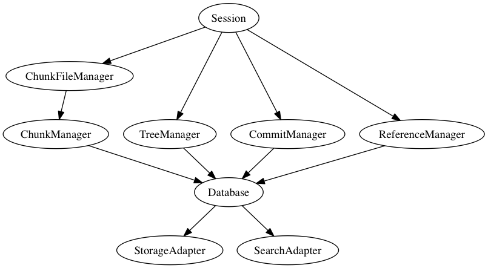
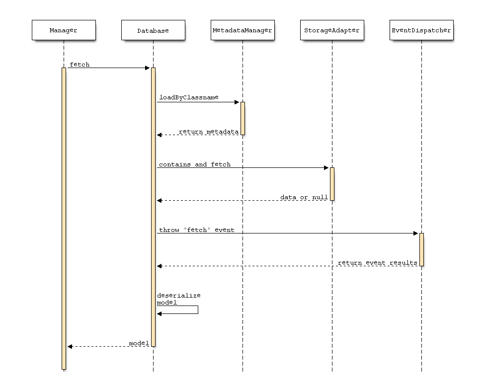

# \label{chapter_implementation}Implementierung

In diesem Kapitel werden die einzelnen Komponenten, die für Symcloud entwickelt wurden, genauer betrachtet. Es entstand während der Entwicklungsphase ein einfacher Prototyp, mit dem die Funktionsweise des, im vorherigen Kapitel beschriebenen Konzeptes, gezeigt werden konnte.

Dabei sind drei wichtige Komponenten entstanden:

Bibliothek (distributed-storage)

:   Die Bibliothek ist der Kern der Applikation und implementiert große Teile des Konzeptes von Symcloud. Sie baut auf modernen Web-Technologien auf und verwendet einige Komponenten des PHP-Frameworks Symfony2[^64]. Dieses Framework ist eines der beliebtesten Frameworks in der Open-Source Community von PHP.

Plattform (symcloud)

:   Die Plattform bietet neben der REST-API auch ein einfaches UI an, mit dem es möglich ist, im Browser seine Dateien zu verwalten. Als Basis verwendet Symcloud die Content-Management-Plattform SULU[^65] der Vorarlberger Firma MASSIVE ART WebServices GmbH[^66] aus Dornbirn. Diese Plattform bietet ein erweiterbares Admin-UI, eine Benutzerverwaltung und ein Rechtesystem. Diese Features ermöglichen Symcloud eine schnelle Entwicklung der Oberfläche und deren zugrundeliegenden Services.

Client (jibe)

:   Der Client ist ein Konsolen-Tool, mit dem es möglich ist, Dateien aus einem Ordner mit dem Server zu synchronisieren. Es dient als Beispiel für die Verwendung der API mit einer externe Applikation.

Der Source-Code dieser drei Komponenten ist auf der Beiliegenden CD (`/source`) oder auf Github <https://github.com/symcloud> zu finden.

## \label{chapter_implementation_distributed_storage}Distributed-Storage

Distributed-Storage ist der Kern der Anwendung und kann als Bibliothek in jede beliebige PHP-Anwendung integriert werden. Diese Anwendung stellt dann die Authentifizierung und die Rest-API zur Verfügung, um mit den Kern-Komponenten zu kommunizieren.



Der interne Aufbau der Bibliothek ist in vier Schichten (siehe Abbildung \ref{architecture_ds}) aufgeteilt.

Session

:   Zentrale Schnittstelle die alle Manager vereint und einen gemeinsamen Zugriffspunkt bildet, um mit dem Storage zu kommunizieren.

Manager

:   Um die Komplexität der jeweiligen Objekte zu abstrahieren, implementieren die Manager die jeweilige Funktionalität um mit diesen Objekten zu kommunizieren. Die Objekte sind dabei reine Daten-Container.

Database

:   Die Datenbank benutzt einfache Mechanismen, um die Objekte zu serialisieren und zu speichern. Dabei kann über Metadaten festgelegt werden, welche Eigenschaften serialisiert bzw. welche Eigenschaften in der Suchmaschine indexiert werden. Beim laden der Daten aus der Datenbank, können mithilfe dieser Metadaten die Objekte wieder deserialisiert werden.

Adapter

:   Die Adapter dienen dazu, das Speichermedium bzw. die Suchmaschine zu abstrahieren. Durch die Implementierung eines Interfaces, kann jede beliebige Speichertechnologie bzw. Suchmaschine verwendet werden.

Die Datenbank ist durch den Einsatz von Events flexibel erweiterbar. Mithilfe dieser Events kann zum Beispiel die Replikator-Komponente folgende Abläufe realisieren.

Verteilung

:   Bei einem "store" Event, verteilt der Replikator das Objekt auf die ermittelten Backup-Server. Um die Einstellungen des Replikators zu persistieren fügt der Eventhandler eine "ReplicatorPolicy" an das Model an. Diese "Policy" wird dann zusätzlich mit Model persistiert.

Nachladen

:   Im Falle eines "fetch" Events, werden fehlende Daten von den bekannten Servern nachgeladen. Dieses Event wird sogar dann geworfen, wenn die Daten im lokalen "StorageAdapter" nicht vorhanden sind. Dies erkennt der Replikator und beginnt alle bekannten Servern anzufragen, ob sie dieses Objekt kennen. Dies gilt für die Replikationstypen "Permission" und "Full". Über einen ähnlichen Mechanismus kann der Replikationstyp "stub" realisiert werden. Der einzige unterschied ist, dass die backup erver den primary Server kennen und nicht alle bekannten Server durchsuchen müssen.

### Objekte speichern

Der Mittelpunkt des Speicher-Prozesses (siehe Abbildung \ref{database_store}) ist die Serialisierung zu Beginn. Hierfür werden die Metadaten des Modells anhand seiner Klasse aus dem "MetadataManager" geladen und anhand dieser Informationen das Objekt serialisiert. Diese Daten werden mithilfe des "EventDispatcher", aus dem Symfony2 Framework, in einem Event zugänglich gemacht. Die Eventhandler haben, die Möglichkeit die Daten zu bearbeiten und "Policies" zu dem Model zu erstellen. Abschließend werden die Daten zuerst mithilfe des "StorageAdapter" persistiert und dann mithilfe des "SearchAdapter" in den Suchmaschinenindex aufgenommen. Um die Daten voneinander zu trennen geben die Metadaten der Klasse einen eindeutigen Kontext zurück. Dieser Kontext wird den Adaptern übergeben um Kollisionen zwischen den Objekten zu verhindern.


### Objekte abrufen

Wie zu erwarten, ist der Abruf-Prozess von Daten, ein Spiegelbild des Speicher-Prozesses. Zuerst wird versucht, mithilfe des Kontextes der Klassen-Metadaten, die Daten aus dem Storage zu laden. Diese Daten werden mithilfe des "EventDispatcher" den Eventhandler zur Verfügung gestellt. Diese haben dann die Möglichkeit, zum Beispiel fehlende Daten nachzuladen oder Änderungen an der Struktur durchzuführen. Diese veränderten Daten werden abschließend für den Deserialisierungs-Prozess herangezogen.



\newpage

Diese beiden Abläufe beschreiben eine lokale Datenbank, die die Möglichkeit bietet über Events die Daten zu verändern oder anderweitig zu verwenden. Sie ist unabhängig zum Datenmodell von Symcloud und könnte für alle möglichen Objekte verwendet werden. Daher ist Symcloud auch für künftige Anforderungen gerüstet.

### Replikator

Wie schon erwähnt, verwendet der Replikator Events, um die Prozesse des Ladens und Speicherns von Daten zu beeinflussen und damit die verteilte Aspekte für die Datenbank umzusetzen. Dabei implementiert der Replikator eine einfache Version des primärbasierten Protokolls. Für diesen Zweck wird der Replikator mit einer Liste von verfügbaren Servern initialisiert. Auf Basis dieser Liste werden die Backup-Server für jedes Objekte ermittelt.

Wie schon im Kapitel \ref{chapter_concept_database} erwähnt, gibt es verschiedene Arten die backup Server für ein Objekt zu ermitteln. Implementiert wurde neben dem Typ "Full" auch ein automatisches "Lazy"-Nachladen für fehlende Objekte. Dieses Nachladen ist ein wesentlicher Bestandteil der beiden anderen Typen ("Permission" und "Stub").

__Full__


Bei einem "store" Event werden die backup Server per Zufall aus der Liste der vorhandenen Server ausgewählt und der aktuelle Server als primäry Server markiert. Anhand der Backupserver Liste werden die Daten an die Server verteilt. Dazu wird, der Reihe nach, die Daten an die Server versendet und auf eine Bestätigung gewartet. Damit wird der konsistente Zustand der Datenbank verifiziert. Abschließend wird die erstellte "Policy" zu den Daten hinzugefügt, damit sie mit dem Daten persistiert wird und später wiederverwendet werden kann. Dieser Prozess wird in der Abbildung \ref{replicator_full} visualisiert.

__Lazy__


Um fehlende Daten im lokalen Speicher nachzuladen, werden der Reihe nach alle bekannten Server abgefragt. Dabei gibt es vier mögliche Antworten (siehe Abbildung \ref{replicator_lazy}), auf die der Replikator reagieren kann. Der Status kann anhand des HTTP-Status-Codes erkannt werden.

404

:   Das Objekt ist auf dem angefragten Server nicht bekannt.

302

:   Das Objekt ist bekannt, aber der angefragte Server ist nur als backup Server markiert. Dieser Server kennt allerdings die genaue Adresse des primary Servers und leitet auf diesen weiter.

403

:   Das Objekt ist bekannt und der angefragte Server als primary Server für dieses Objekt markiert. Der Server überprüft die Zugangsberechtigung, weil diese aber nicht gegeben sind, wird der Zugriff verweigert. Der Replikator erkennt, dass der Benutzer nicht Berechtigt ist die Daten zu lesen und verweigert den Zugriff.

200

:   Wie bei 403, ist der angefragte Server der primary Server des Objektes, aber der Benutzer ist berechtigt das Objekt zu lesen und der Server gibt direkt die Daten zurück. Diese Daten dürfen dann auch gecached werden. Die Berechtigungen für andere Benutzer, werden direkt mitgeliefert, um später diesen Prozess nicht noch einmal ausführen zu müssen. 

Mithilfe dieses einfachen Mechanismuses kann der Replikator Daten von anderen Servern nachladen, ohne zu wissen, wo sich die Daten befinden. Dieser Prozess bringt allerdings Probleme mit sich. Zum Beispiel muss jeder Server angefragt werden, bevor der Replikator endgültig sagen kann, dass das Objekt nicht existiert. Dieser Prozess kann daher bei einem Großen Netzwerk sehr lange dauern. Dieser Fall sollte allerdings aufgrund des Datenmodells nur selten vorkommen, da Daten nicht gelöscht werden und daher keine Deadlinks entstehen können.

### Adapter

Für die Abstrahierung des Speichermediums verwendet die Datenbank das Adapter-Pattern. Mithilfe dieses Patterns, kann jede Symcloud Installation sein eigenes Speichermedium verwenden. Dabei gibt es zwei Arten von Adaptern:

Storage

:   Der "StorageAdapter" wird dazu verwendet, um serialisierte Objekte lokal zu speichern oder zu laden. Es implementiert im Grunde ein einfacher Befehlssatz: `store`, `fetch`, `contains` und `delete`. Jeder dieser Befehle erhält, neben anderen Parametern, einen Hash und einen Kontext. Der Hash ist sozusagen der Index des Objektes. Der Kontext wird verwendet um Namensräume für die Hashes zu schaffen. Dies implementiert der Dateisystemadapter, indem er jeden Kontext einen Ordner erstellt und für jeden Hash eine Datei. So kann schnell auf ein einzelnes Objekt zugegriffen werden.

Search

:   Der "SearchAdapter" wird verwendet um die Metadaten zu den Objekten zu indexieren. Dies wird benötigt wenn die Daten durchsucht werden. Jeder Adapter implementiert folgende Befehle: `index`, `search` und `deindex`. Wobei auch hier mit Hash und Kontext gearbeitet wird. Über den Suchbefehl, können alle oder bestimmte Kontexte durchsucht werden. Als Prototypen Implementierung wurde die Bibliothek Zend-Search-Lucene[^67] verwendet, da diese ohne weitere Abhängigkeiten verwendet werden kann.

Bei der Verwendung des Replikators, gibt es einen zusätzlichen Adapter, der mithilfe der Server-Informationen, mit dem Remote-Server kommunizieren kann. Dabei wird das Interface mit den Befehlen `fetch` und `store` implementiert.

Die Adapter sind also Klassen, die die Komplexität des Speichermediums bzw. der API von der restlichen Applikation trennt.

### Manager

Die Manager sind die Schnittstelle, um mit den einzelnen Schichten des Datenmodells zu kommunizieren. Jeder dieser Manager implementiert ein "Interface" mit dem es möglich ist mit den jeweiligen Models zu interagieren. Im Grunde genommen, sind dies meist Befehle um ein Objekt zu erstellen oder abzufragen. Im falle des "ReferenceManager" oder "TreeManager" bieten sie auch die Möglichkeit Objekte zu bearbeiten. Der ReferenceManager bearbeitet dabei auch wirklich ein Objekt in der Datenbank, indem er es einfach überschreibt. Der "TreeManager" klont das Objekt und erstellt unter einem neuen Hash ein neues Objekt sobald es mit einem Commit zusammen persistiert wird.

### Zusammenfassung

Die Bibliothek "Distributed-Storage" bietet eine einfache und effiziente Implementierung des, in Kapitel \ref{chapter_concept}, beschriebenen Konzeptes. Es baut auf eine erweiterbare Hash-Orientierte Datenbank auf. Diese Datenbank wird mittels eines Eventhandlers (Replikator) zu einer verteilten Datenbank. Dabei hat die Datenbank keine Ahnung von dem verwendeten Transportlayers. Dieser kann neben HTTP, jeden beliebigen anderen Transportlayer verwenden, wie zum Beispiel UDP. Der konsistente Zustand der Datenbank kann mittels Bestätigungen bei der Erstellung, blockierenden Vorgängen und nicht löschbaren Objekten garantiert werden. Nicht veränderbare Objekte lassen sich dauerhaft und ohne Updates verteilen. Alle anderen Objekte können so markiert werden, dass sie immer bei einem primary Server angefragt werden müssen und nur für die Datensicherheit an die Backup-Server verteilt werden.

## \label{chapter_implementation_platform}Plattform

Die Plattform bzw. die Anwendung in die Bibliothek eingebettet wird, stellt der Bibliothek die Rest-API und die Authentifizierung zur Verfügung. Zusätzlich beinhaltet sie die Oberfläche um mit den Daten in Browser zu interagieren.

### Authentifizierung

Die Authentifizierung und die Benutzerverwaltung stellt die Plattform SULU zur Verfügung. Hierfür wird der "UserProvider" von SULU dem "Distributed-Storage" bekannt gemacht. Allerdings stellt die Plattform nur eine Authentifizierung mittels HTML-Formular (Benutzername und Passwort) oder HTTP-Basic standardmäßig zur Verfügung, um die Verwendung der API auch für Dritt-Entwickler Applikationen zu ermöglichen, wurde das Protokoll OAuth2 in SULU integriert. Eine genauere Beschreibung dieses Protokolls wird im Kapitel \ref{implementation_oauth} gegeben.

Eine Autorisierung zwischen den Servern, ist momentan nicht vorgesehen, es wäre allerdings möglich, über das OAuth2 Protokoll die Requests dem richtigen Benutzer zuzuordnen. Dies wurde allerdings in der ersten Implementierungsphase nicht umgesetzt, wäre aber für eine produktiven Einsatz unerlässlich.

### Rest-API

Die Rest-API ist wie schon im Kapitel \ref{chapter_concept_rest_api} beschrieben, in vier verschiedene Schnittstellen aufgeteilt. Dabei werden die SULU internen Komponenten verwendet um die Daten für die Übertragung zu serialisieren und RESTful[^68] aufzubereiten. Aufgrund dessen, dass Symcloud den Replikator verwendet, implementiert die Plattform den "ApiAdapter" um die Rest-AIP zu abstrahieren.

### Benutzeroberfläche

Die Benutzeroberfläche ... __TODO was wurde/wird implementiert__

### Zusammenfassung

Die Plattform ist ein reiner Prototyp, der zeigen soll, ob das konzipierte Konzept funktionieren kann. Es bietet in den Grundzügen, alle Funktionen an, um in einer späteren Implementierungsphase, diesen Prototypen zu einer vollständigen Plattform heranwachsen zu lassen.

## \label{implementation_oauth}Exkurs: OAuth2

Für die Authentifizierung wurde das Protokoll OAuth in der Version 2 implementiert. Dieses offene Protokoll erlaubt eine standardisierte, sichere API-Autorisierung für Desktop, Web und Mobile-Applikationen. Initiiert wurde das Projekt von Blaine Cook und Chris Messina [@wikioauth].

Der Benutzer kann einer Applikation den Zugriff auf seine Daten autorisieren, die von einer andere Applikation zur Verfügung gestellt wird. Dabei werden nicht alle Details seiner Zugangsdaten preisgegeben. Typischerweise wird die Weitergabe eines Passwortes an Dritte vermieden [@wikioauth].

### Begriffe

In OAuth2 werden folgende vier Rollen definiert:

Resource owner

:   Besitzer einer Ressource, die er für eine Applikation bereitstellen will [@hardt2012oauth, Seite 5].

Resource server

:   Der Server, der die geschützen Ressourcen verwaltet. Er ist in der Lage Anfragen zu akzeptieren und die geschützten Ressourcen zurückzugeben, wenn ein geeignetes und valides Token bereitgestellt wurde [@hardt2012oauth, Seite 5].

Client

:   Die Applikation stellt Anfragen, im Namen des Ressourceneigentümers, an den "resource server". Sie holt sich vorher die Genehmigung von einem berechtigten Benutzer [@hardt2012oauth, Seite 5].

Authorization server

:   Der Server, der Zugriffs-Tokens, nach der erfolgreichen Authentifizierung des Ressourceneigentümers, bereitstellt [@hardt2012oauth, Seite 5].

Neben diesen Rollen, spezifiziert OAuth2 diese Begriffe:

Access-Token

:   Access-Tokens fungieren Zugangdsdaten zu geschützten Ressourcen. Es besteht aus einer Zeichenkette, der als Autorisierung für einen bestimmten Client ausgestellt wurde. Sie repräsentieren die "Scopes" und die Dauer der Zugangsberechtigung, die durch den Benutzer bestätigt wurde [@hardt2012oauth, Seite 9].

Refresh-Token

:   Diese Tokens werden verwendet um neue Access-Tokens zu generieren, wenn der alte abgelaufen ist. Wenn der Autorisierungsserver diese Funktionalität zur Verfügung stellt, liefert er es mit dem Access-Token aus. DerRefresh-Token, besitzt eine längere Lebensdauer und berechtigt nicht den Zugang zu den anderen API-Schnittstellen [@hardt2012oauth, Seite 9].

Scopes

:   Mithilfe von Scopes, lassen sich Access-Token für bestimmte Bereiche der API beschränken. Dies kann sowohl auf Clientebene als auch auf Access-Token Ebene spezifiziert werden [@hardt2012oauth, Seite 22].

Die Interaktion zwischen "Resource server" und "Authorization server" ist nicht spezifiziert. Der Autorisierungsserver und der Ressourcenserver können auf dem selben Server bzw. in der selben Applikation betrieben werden. Aber auch eine verteilte Infrastruktur wäre mäglich. Dabei würden die beiden auf verschiedenen Servern betrieben werden. Der Autorisierungsserver könnte dabei Tokens für mehrere Ressourcenserver bereitstellen [@hardt2012oauth, Seite 5].

### Protokoll Ablauf


Der Ablauf einer Autorisierung [@hardt2012oauth, Seiten 6 ff] mittels Oauth2, der in der Abbildung \ref{oauth_flow} abgebildet ist, enthält folgende Schritte:

A) Der Client fordert die Genehmigung des "Resource owner". Diese Anfrage kann direkt an den Benutzer gemacht werden (wie in der Abbildung dargestellt) oder vorzugsweise indirekt über den "Authorization server" (wie zum Beispiel bei Facebook).
B) Der Client erhält einen "authorization grant". Er repräsentiert die Genehmigung des "Resource owner" die geschützten Ressourcen zu verwenden.
C) Der Client fordert einen Token beim "Autorization server" mit dem "authorization grant" an.
D) Der "Autorization server" authentifiziert den Client, validiert den "authorization grant" und gibt einen Token zurück.
E) Der Client fordert eine geschützte Ressource und autorisiert die Anfrage mit dem Token.
F) Der "Resource server" validiert den Token, validiert ihn und gibt die Ressource zurück.

### Zusammenfassung

OAuth2 wird verwendet um es externen Applikationen zu ermöglichen auf die Dateien der Benutzer zuzugreifen. Das Synchronisierungsprogramm Jibe verwendet dieses Protokoll, um die Autorisierung zu erhalten, die Dateien des Benutzers zu verwalten.

## Synchronisierungsprogramm: Jibe

Jibe ist das Synchronisierungsprogramm zu einer Symcloud Installation. Es ist ein einfaches PHP-Konsolen Tool, mit dem es möglich ist Daten aus einer Symcloud-Installation mit einem Endgerät zu Synchronisieren.

Das Programm wurde mit Hilfe der Symfony Konsole-Komponente[^60] umgesetzt. Diese Komponente ermöglicht eine schnelle und unkomplizierte Entwicklung solcher Konsolen-Programme.

```bash
$ php jibe.phar
       ___                     ___           ___
      /\  \        ___        /\  \         /\  \
      \:\  \      /\  \      /::\  \       /::\  \
  ___ /::\__\     \:\  \    /:/\:\  \     /:/\:\  \
 /\  /:/\/__/     /::\__\  /::\~\:\__\   /::\~\:\  \
 \:\/:/  /     __/:/\/__/ /:/\:\ \:|__| /:/\:\ \:\__\
  \::/  /     /\/:/  /    \:\~\:\/:/  / \:\~\:\ \/__/
   \/__/      \::/__/      \:\ \::/  /   \:\ \:\__\
               \:\__\       \:\/:/  /     \:\ \/__/
                \/__/        \__/__/       \:\__\
                                            \/__/
Token-Status: OK
   run jibe sync to start synchronization

```

Ein Konsolen-Programm besteht aus verschiedenen Kommandos, die über einen Namen aufgerufen werden können. Im diesem Beispiel wurde das Standard-Kommando des Tools aufgerufen. Über den Befehl `php jibe.phar sync` kann der Synchronisierungsvorgang gestartet werden. Alle Abhängigkeiten des Tools werden zusammen in einen PHAR-Container[^61] geschrieben. Dieser ähnelt dem Format eines Java-JAR Archivs. Dieses Format wird in der PHP-Gemeinschaft oft verwendet um Komplexe Applikationen wie zum Beispiel PHPUnit[^62] (ein Test Framework für PHP) auszuliefern.

```bash
$ php jibe.phar configure
Server base URL: http://symcloud.lo
Client-ID: 9_1442hepr9cpw8wg8s0o40s8gc084wo8ogso8wogowookw8k0sg
Client-Secret: 4xvv8pn29zgoccos0c4g4sokw0ok0sgkgkso04408k0ckosk0c
Username: admin
Password:
```

Fehlende Argumente, können vom Benutzer automatisch abgefragt werden. Eine Validierung, von zum Beispiel der URL, kann direkt in einem Kommando implementiert werden.

Diese Kommandos stehen dem Benutzer zur Verfügung:

configure

:   Konfiguriert den Zugang zu einer Symcloud Installation. Falls notwendig koordiniert sich das Tool mit der Installation, um andere Informationen zu Repliken oder verbundenen Installationen, zu erhalten.

refresh-token

:   Aktualisiert das Zugang-Token von OAuth2. Dies ist Notwendig, da diese über ein Ablaufzeitpunkt verfügen.

status

:   Gibt den aktuellen Status des Zugangs-Token aus. Wenn kein andere Kommando angegeben wurde, wird dieses aufgerufen.

sync

:   Startet den Synchronisierungsvorgang. Über die Option `-m` kann eine Nachricht zu dem erstellten Commit angefügt werden.

### Architektur


Der zentrale Bestandteil von Jibe ist eine "CommandQueue" (siehe Abbildung \ref{jibe_architecture}). Sie sammelt alle nötigen Kommandos ein und führt sie dann nacheinander aus. Diese "Queue" ist nach dem "Command-Pattern" entworfen. Folgende Befehle können dadurch aufgerufen werden:

Upload

:   Datei auf den Server hochladen.

Download

:   Datei wird vom Server heruntergeladen und lokal in eine bestimmte Datei geschrieben.

DeleteServer

:   Datei auf dem Server wird gelöscht.

DeleteLocal

:   Lokale Datei wird gelöscht.

Aus diesen vier Kommandos lässt sich nun ein kompletter Synchronisierungsvorgang abbilden.

### Abläufe

Für einen kompletten Synchronisierungsvorgang werden folgende Informationen benötigt:

Lokale Hashwerte

:   Diese werden aus den aktuellen Dateibeständen generiert.

Zustand der Dateibestände

:   Der Zustand nach der letzten Synchronisierung. Wenn diese Hashwerte mit den aktuellen Hashwerten verglichen werden, kann zuverlässig ermittelt werden, welche Dateien sich geändert haben. Zusätzlich kann die Ausgangsversion der Änderung erfasst werden um Konflikte zu erkennen.

Aktueller Serverzustand

:   enthält die aktuellen Hashwerte und Versionen aller Dateien, die auf dem Server bekannt sind. Diese werden verwendet, um zu erkennen, dass sich Dateien auf dem Server verändert haben bzw. gelöscht wurden.

Diese drei Informationspakete können sehr einfach ermittelt werden. Einzig und alleine der Zustand der Dateien muss nach einer Synchronisierung beim Client gespeichert werden, um diese beim nächsten Vorgang wiederzuverwenden.

Die Tabelle \ref{table_jibe_flow} gibt Aufschluss über die Erkennung von Kommandos aus diesen Informationen.

+---+------+---------+------+---------+---------------------------------------------+----------+--------+--------------+---------------+----------+
|   | hash | old v.  | hash | version |                                             | Download | Upload | Delete local | Delete server | Conflict |
+---+------+---------+------+---------+---------------------------------------------+----------+--------+--------------+---------------+----------+
| 1 | X    | 1       | X    | 1       | Nothing to be done                          |          |        |              |               |          |
| 2 | X    | 1       | Y    | 2       | Server file changed, download new version   | x        |        |              |               |          |
| 3 | Y    | 1       | X    | 1       | Client file change, upload new version      |          | x      |              |               |          |
| 4 | Y    | 1       | Z    | 2       | Client and Server file changed, conflict    |          |        |              |               | x        |
| 5 | Y    | 1       | Y    | 2       | Server file changed but content is the same |          |        |              |               |          |
| 6 | X    | -       | -    | -       | New client file, upload it                  |          | x      |              |               |          |
| 7 | -    | -       | X    | 1       | New server file, download it                | x        |        |              |               |          |
| 8 | X    | 1       | -    | -       | Server file deleted, remove client version  |          |        | x            |               |          |
| 9 | -    | 1       | X    | 1       | Client file deleted, remove server version  |          |        |              | x             |          |
+---+------+---------+------+---------+---------------------------------------------+----------+--------+--------------+---------------+----------+

  : Evaluierung der Zustände\label{table_jibe_flow}

__Folgende TODOs für diese Tabelle:__

* Lesbarkeit verbessern
* Alter Dateihash hinzufügen
* Ändere X/Y und 1/2 zu Allgemein gültigen Werten (n/n+1)
* Muss aktuell gehalten werden

__TODOs ende__

Beispiel der Auswertungen anhand des Falles Nummer vier:

1. Lokale Datei hat sich geändert: Alter Hashwert unterscheidet sich zu dem aktuellen.
2. Serverversion ist Größer als lokale Version.
3. Aktueller und Server-Hashwert stimmen nicht überein.

Das bedeutet, dass sich sowohl die Serverdatei als auch die Lokale Kopie geändert haben. Dadurch entsteht ein Konflikt, der aufgelöst werden muss. Das auflösen solcher Konflikte ist nicht der Arbeit, er wird allerdings im Kapitel \ref{outlook_conflict} kurz behandelt.

### Zusammenfassung

Der Synchronisierungsclient ist ein Beispiel dafür, wie die Rest-API von anderen Applikationen verwendet werden kann, um die Daten aus Symcloud zu verwenden. Es wären viele verschiedene Anwendungsfälle denkbar.

In diesem Beispiel wurde auch die Komplexität des Synchronisierungsprozesses durchleuchtet und eine Lösung geschaffen, um schnell und effizient einen Ordner mit Symcloud zu synchronisieren.

## Zusammenfassung

__TODO Zusammenfassung Kapitel Implementierung__

[^60]: <http://symfony.com/doc/current/components/console/introduction.html>
[^61]: <http://php.net/manual/de/intro.phar.php>
[^62]: <https://phpunit.de/>
[^63]: <http://tools.ietf.org/html/rfc5789#section-2.1>
[^64]: <http://symfony.com/>
[^65]: <http://www.sulu.io>
[^66]: <http://www.massiveart.com/de>
[^67]: <http://framework.zend.com/manual/1.12/de/zend.search.lucene.html>
[^68]: <http://restcookbook.com/>
