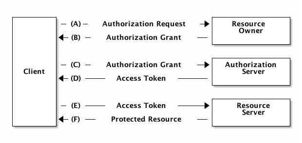

# Implementierung

In diesem Kapitel werden die einzelnen Komponenten, die für Symcloud entwickelt wurden, genauer betrachtet.

__TODO Liste von Themen:__

* Distributed Storage:
  * Dateimodell
    * Referenzen
    * Symlinks
    * Versionierung
  * Datenbank Abstraktion:
    * Warum Riak und nicht GridFS, S3 oder XtreemFS?
    * Beschreibung und Ansätze um einen "Lokalen" Adapter zu implementieren
  * Sync-Client Abläufe und Implementierung

## OAuth2

Für die Authentifizierung wurde das Protokoll OAuth in der Version 2 implementiert. Dieses offene Protokoll erlaubt eine standardisierte, sichere API-Autorisierung für Desktop, Web und Mobile-Applikationen. Initiiert wurde das Projekt von Blaine Cook und Chris Messina. [@wikioauth]

Der Benutzer kann einer Applikation den Zugriff auf seine Daten autorisieren, die von einer andere Applikation zur Verfügung gestellt wird. Dabei werden nicht alle Details seiner Zugangsdaten preisgegeben. Typischerweise wird die Weitergabe eines Passwortes an Dritte vermieden. [@wikioauth]

### Begriffe

In OAuth2 werden folgende vier Rollen definiert:

Resource owner

:   Besitzer einer Ressource, die er für eine Applikation bereitstellen will.

Resource server

:   Der Server, der die Geschützen Ressourcen verwaltet. Er ist in der Lage Anfragen zu akzeptieren und die geschützten Ressourcen zurückzugeben, wenn ein geeignetes und valides Token bereitgestellt wurde.

Client

:   Die Applikation stellt Anfragen, im Namen des Ressourceneigentümers, an den sesource server. Sie holt sich vorher die Genehmigung zu diesen geschützten Ressourcen.

Authorization server

:   Der Server, der Zugriffs-Tokens, nach der erfolgreichen Authentifizierung des Ressourceneigentümers, bereitstellt.

Die Interaktion zwischen "Resource server" und "Authorization server" ist nicht spezifiziert. Der Autorisierungsserver und Ressourcenserver können auf dem selben Server bzw. in der selben Applikation betrieben werden. Eine andere Möglichkeit wäre es, dass die beiden Server auf verschiedenen Server zu betreiben. Ein Autorisierungsserver kann auch Zugriffstoken für mehrere Ressourcenserver bereitstelle. [@hardt2012oauth, Seite 5]

### Protokoll Ablauf

Der Ablauf einer Autorisierung [@hardt2012oauth, Seiten 6 ff] mittels Oauth2, der in der Abbildung \ref{oauth_flow} abgebildet ist, enthält folgende Schritte:

A) Der Client fordert die Genehmigung des "Resource owner". Diese Anfrage kann direkt an den Benutzer gemacht werden (wie in der Abbildung dargestellt) oder vorzugsweise indirekt über den "Authorization server" (wie zum Beispiel bei Facebook).
B) Der Client erhält einen "authorization grant". Er repräsentiert die Genehmigung des "Resource owner" die geschützten Ressourcen zu verwenden.
C) Der Client fordert einen Token beim "Autorization server" mit dem "authorization grant" an.
D) Der "Autorization server" authentifiziert den Client, validiert den "authorization grant" und gibt einen Token zurück.
E) Der Client fordert eine geschützte Ressource und autorisiert die Anfrage mit dem Token.
F) Der "Resource server" validiert den Token, validiert ihn und gibt die Ressource zurück.

### Anwendung

OAuth2 wird verwendet um es externen Applikationen zu ermöglichen auf die Dateien der Benutzer zuzugreifen. Der Sync-Client verwendet diese Authorizierungsmöglichkeit um Dateien des Benutzers zu synchronisieren.

