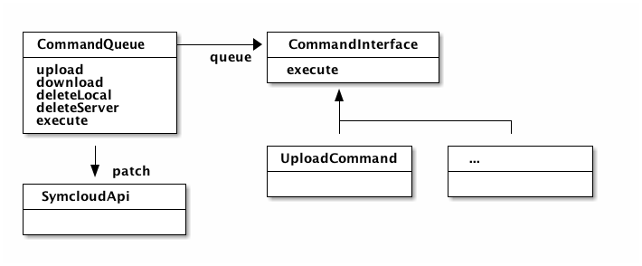

# Implementierung

In diesem Kapitel werden die einzelnen Komponenten, die für Symcloud entwickelt wurden, genauer betrachtet.

__TODO Liste von Themen:__

* Distributed Storage:
  * Dateimodell
    * Referenzen
    * Symlinks
    * Versionierung
  * Datenbank Abstraktion:
    * Warum Riak und nicht GridFS, S3 oder XtreemFS?
    * Beschreibung und Ansätze um einen "Lokalen" Adapter zu implementieren
  * Sync-Client Abläufe und Implementierung
  * Verteilte Aspekte
    * Replikationen
    * Lock-Mechanismen
    * Autorisierung

## OAuth2\label{implementation_oauth}

Für die Authentifizierung wurde das Protokoll OAuth in der Version 2 implementiert. Dieses offene Protokoll erlaubt eine standardisierte, sichere API-Autorisierung für Desktop, Web und Mobile-Applikationen. Initiiert wurde das Projekt von Blaine Cook und Chris Messina. [@wikioauth]

Der Benutzer kann einer Applikation den Zugriff auf seine Daten autorisieren, die von einer andere Applikation zur Verfügung gestellt wird. Dabei werden nicht alle Details seiner Zugangsdaten preisgegeben. Typischerweise wird die Weitergabe eines Passwortes an Dritte vermieden. [@wikioauth]

### Begriffe

In OAuth2 werden folgende vier Rollen definiert:

Resource owner

:   Besitzer einer Ressource, die er für eine Applikation bereitstellen will.

Resource server

:   Der Server, der die Geschützen Ressourcen verwaltet. Er ist in der Lage Anfragen zu akzeptieren und die geschützten Ressourcen zurückzugeben, wenn ein geeignetes und valides Token bereitgestellt wurde.

Client

:   Die Applikation stellt Anfragen, im Namen des Ressourceneigentümers, an den sesource server. Sie holt sich vorher die Genehmigung zu diesen geschützten Ressourcen.

Authorization server

:   Der Server, der Zugriffs-Tokens, nach der erfolgreichen Authentifizierung des Ressourceneigentümers, bereitstellt.

Scopes

:   TODO

Die Interaktion zwischen "Resource server" und "Authorization server" ist nicht spezifiziert. Der Autorisierungsserver und Ressourcenserver können auf dem selben Server bzw. in der selben Applikation betrieben werden. Eine andere Möglichkeit wäre es, dass die beiden Server auf verschiedenen Server zu betreiben. Ein Autorisierungsserver kann auch Zugriffstoken für mehrere Ressourcenserver bereitstelle. [@hardt2012oauth, Seite 5]

### Protokoll Ablauf


Der Ablauf einer Autorisierung [@hardt2012oauth, Seiten 6 ff] mittels Oauth2, der in der Abbildung \ref{oauth_flow} abgebildet ist, enthält folgende Schritte:

A) Der Client fordert die Genehmigung des "Resource owner". Diese Anfrage kann direkt an den Benutzer gemacht werden (wie in der Abbildung dargestellt) oder vorzugsweise indirekt über den "Authorization server" (wie zum Beispiel bei Facebook).
B) Der Client erhält einen "authorization grant". Er repräsentiert die Genehmigung des "Resource owner" die geschützten Ressourcen zu verwenden.
C) Der Client fordert einen Token beim "Autorization server" mit dem "authorization grant" an.
D) Der "Autorization server" authentifiziert den Client, validiert den "authorization grant" und gibt einen Token zurück.
E) Der Client fordert eine geschützte Ressource und autorisiert die Anfrage mit dem Token.
F) Der "Resource server" validiert den Token, validiert ihn und gibt die Ressource zurück.

### Anwendung

OAuth2 wird verwendet um es externen Applikationen zu ermöglichen auf die Dateien der Benutzer zuzugreifen. Das Synchronisierungsprogramm Jibe verwendet dieses Protokoll um die Autorisierung zu erhalten, die Dateien des Benutzers zu verwalten.

## Synchronisierungsprogramm: Jibe

Jibe ist das Synchronisierungsprogramm zu einer Symcloud Installation. Es ist momentan ein einfaches PHP-Konsolen Tool, mit dem es möglich ist Daten aus einer Symcloud-Installation mit einem Endgerät zu Synchronisieren.

Das Programm wurde mit Hilfe der Symfony Konsole-Komponente[^60] umgesetzt. Diese Komponente ermöglicht eine schnelle und unkomplizierte Entwicklung solcher Konsolen-Programme.

```bash
$ php jibe.phar
       ___                     ___           ___
      /\  \        ___        /\  \         /\  \
      \:\  \      /\  \      /::\  \       /::\  \
  ___ /::\__\     \:\  \    /:/\:\  \     /:/\:\  \
 /\  /:/\/__/     /::\__\  /::\~\:\__\   /::\~\:\  \
 \:\/:/  /     __/:/\/__/ /:/\:\ \:|__| /:/\:\ \:\__\
  \::/  /     /\/:/  /    \:\~\:\/:/  / \:\~\:\ \/__/
   \/__/      \::/__/      \:\ \::/  /   \:\ \:\__\
               \:\__\       \:\/:/  /     \:\ \/__/
                \/__/        \__/__/       \:\__\
                                            \/__/
Token-Status: OK
   run jibe sync to start synchronization

```

Ein Konsolen-Programm besteht aus verschiedenen Kommandos, die über einen Namen aufgerufen werden können. Im diesem Beispiel wurde das Standard-Kommando des Tools aufgerufen. Über den Befehl `php jibe.phar sync` kann der Synchronisierungsvorgang gestartet werden. Alle Abhängigkeiten des Tools werden zusammen in einen PHAR-Container[^61] geschrieben. Dieser ähnelt dem Format eines Java-JAR Archivs. Dieses Format wird in der PHP-Gemeinschaft oft verwendet um Komplexe Applikationen wie zum Beispiel PHPUnit[^62] (ein Test Framework für PHP) auszuliefern.

```bash
$ php jibe.phar configure
Server base URL: http://symcloud.lo
Client-ID: 9_1442hepr9cpw8wg8s0o40s8gc084wo8ogso8wogowookw8k0sg
Client-Secret: 4xvv8pn29zgoccos0c4g4sokw0ok0sgkgkso04408k0ckosk0c
Username: admin
Password:
```

Fehlende Argumente können vom Benutzer automatisch abgefragt werden. Eine Validierung, von zum Beispiel der URL, können direkt in einem Kommando implementiert werden.

Diese Kommandos stehen dem Benutzer zur Verfügung:

configure

:   Konfiguriert den Zugang zu einer Symcloud Installation. Falls notwendig koordiniert sich das Tool mit der Installation, um andere Informationen zu Repliken oder verbundenen Installationen, zu erhalten.

refresh-token

:   Aktualisiert das Zugang-Token von OAuth2. Dies ist Notwendig, da diese über ein Ablaufzeitpunkt verfügen.

status

:   Gibt den aktuellen Status des Zugangs-Token aus. Wenn kein andere Kommando angegeben wurde, wird dieses aufgerufen.

sync

:   Startet den Synchronisierungsvorgang. Über die Option `-m` kann eine Nachricht zu dem erstellten Commit angefügt werden.

### Architektur



Der Zentrale Bestandteil von Jibe ist eine `CommandQueue` (siehe Abbildung \ref{jibe_architecture}). Sie sammelt alle nötigen Kommandos ein und führt sie dann nacheinander aus. Diese Queue ist nach den "Command Pattern" entworfen. Folgende Befehle können dadurch aufgerufen werden:

Upload

:   Datei auf den Server hochladen

Download

:   Datei wird vom Server heruntergeladen und lokal in die Datei geschrieben.

DeleteServer

:   Datei auf dem Server wird gelöscht.

DeleteLocal

:   Lokale Datei wird gelöscht.

Aus diesen vier Kommandos lässt sich nun ein kompletter Synchronisierungsvorgang abbilden.

### Kommunikation

Aufgrund der Datenstruktur ist es notwendig, nicht nur die Daten hochzuladen oder zu löschen, sondern auch alle zusammengefassten Änderungen in einem Request an den Server zu senden. Daher retourniert jedes Kommando ein zusätzlicher Befehl, die am Ende des Synchronisierungsvorgans gesammelt an den Server gesendet werden. Diese Befehle weisen folgende Struktur auf:

```json
{
	"command": "delete",
	"path": "/test-file.txt"
}
```

Dieses Kommando führt auf dem Server dazu, dass die angegebene Datei aus dem Baum des Benutzers entfernt wird.

__Update__

```json
{
	"command": "update",
	"path": "/test-file.txt",
	"file": "<hashvalue>"
}
```

Dieses Kommando führt auf dem Server dazu, dass die angegebene Datei einen neuen Inhalt besitzt. Identifiziert wird der neue Inhalt, durch den Hashwert, der beim Upload im "Response" retourniert wird.

__Commit__

```json
{
	"command": "commit",
	"message": "<message>"
}
```

Am Ende des PATCH-Requests[^63] wird ein Commit ausgeführt. Dieser erstellt am Server einen neue Version des Trees. Aufgrund der Tatsache, dass dies in einem einzigen Request ausgeführt wird, kann es in Zukunft über eine Transaktion gesichert werden.

### Abläufe


[^60]: <http://symfony.com/doc/current/components/console/introduction.html>
[^61]: <http://php.net/manual/de/intro.phar.php>
[^62]: <https://phpunit.de/>
[^63]: <http://tools.ietf.org/html/rfc5789#section-2.1>
